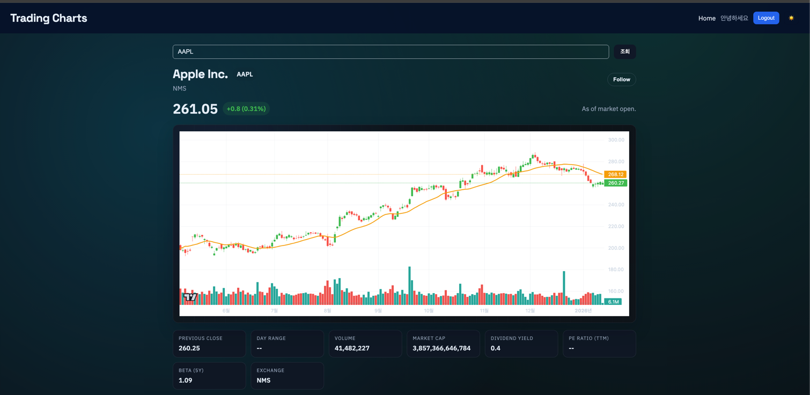
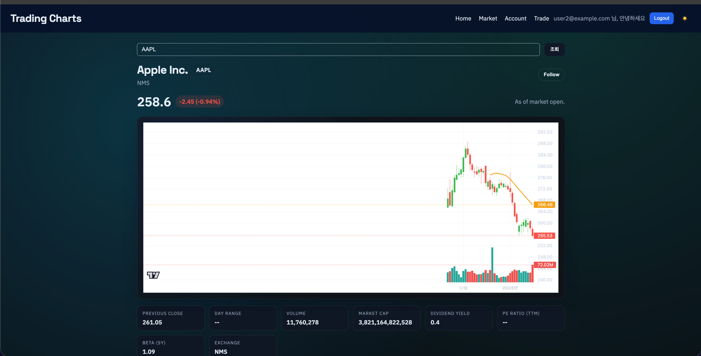

# 증권사 + 은행 서버를 만들어보았다.
## securities_monolithic
- 모놀리식으로 주식 조회 사이트 개발
- Gradle 멀티모듈 백엔드 + React/Vite 프론트엔드 구조
- `web-ui`는 토스 스타일에 가까운 밝고 정돈된 정보형 UI/UX로 개선 진행


### 생각중
---
- 나중에 API GATEWAY + MSA로 떼어낼수 있게 코드 작성한다.
- ADMIN 관리 사이트는 어떻게 해볼까?
- - 결국 내가 하고 싶은거는 백오피스 관리인데
- - 원장 / 전표(Ledger / Journal) 생성 관리인데

### TODOS
---

- [x]AWS 배포
- - [x] web-ui 배포
- - [x] API-SERVER 배포

---
- [x] USER 생성
- [x] JWT 인증
- [x] 주가 조회
- ACCOUNT 설계는 DBS 참고해서 작성해보자.
- https://www.dbs.com/dbsdevelopers/discover/index.html
- - [x] ACCOUNT 도메인 추가
- - [x] ACCOUNT 입/출금 내역 도메인 추가
- - [x] ACCOUNT 생성 Service / RestAPI
- - [x] ACCOUNT 조회 Service / RestAPI
- - [x] ACCOUNT 입금 Service / RestAPI
- - [x] ACCOUNT 출금 Service / RestAPI
- - [x] ACCOUNT 이체 Service / RestAPI
- 주식 구매(Trade)
- - [X] Order 도메인 추가
- - [X] OrderFill(주문 체결) 도메인 추가 
- - [ ] Position 도메인 추가
- - [ ] Trade 도메인 추가
- - [X] Order 생성 Service / RestAPI
- - [ ] OrderFill(체결)을 어떤식으로 처리할지 고민중
- - - 현업이면 증권가 서버로 넣었다가 queue로 체결 결과 받는거 같은데....
- - - client가 REST API로 체결 / 체결실패 하는거는 아닌거 같고..
- - - TEST 용으로는 REST API를 만들어 놓을까? 고민중
- - - 체결이 되어야 POSITION / TRADE가 생성되니깐..
- - - ORDER 넣으면 eventPulisher로 체결 요청 날리고 비동기로 랜덤 처리를 할까?

- - [ ] Position 조회 Service / RestAPI
- - [ ] Trade 조회 Service / RestAPI

- 환율 / 환전 개발해보자
- - [x] 환율 구간 Entity / Repository / Service
- - [ ] 환율 조회 API 조사
- - 

# local 실행
---

## 전체 실행 스크립트
---
```
chmod +x ./script/all-start.sh ./script/all-stop.sh ./script/all-restart.sh
./script/all-start.sh
./script/all-stop.sh
./script/all-restart.sh
```

### 빠른 접속 정보
---
- UI: http://localhost:5173/
- API: http://localhost:8080/
- Swagger: http://localhost:8080/swagger-ui.html
- Demo 계정: `user1@example.com`
- Demo 비밀번호: `Password!`

## API SERVER 실행
---
```
# infra docker 실행
./run_infra.sh
./gradlew api-server:bootRun
```
### API-SERVER
---
- 서버 메인 : http://localhost:8080/
- swagger : http://localhost:8080/swagger-ui.html
- api docs : http://localhost:8080/v3/api-docs

### docker mariadb
---
- prot: 43306
- url: localhost:43306/trade
- root password: rootpassword
- - user: appuser
- - password: appuser

### redis
- port: 6379
- url: localhost:6379
- requirepass: redis1234
- redis UI
- - url: http://localhost:8081

### yfinance-server
- url: http://localhost:18000/
- swagger: http://localhost:18000/swagger-ui.html
- api docs: http://localhost:18000/v3/api-docs
- redoc: http://localhost:18000/redoc

## UI 실행
```
cd web-ui && npm install && npm run dev
```
- UI 주소: http://localhost:5173/

### 최근 UI/UX 개선 내용
---
- 상단 헤더를 앱 셸 형태로 재구성
- 홈 화면을 데모 소개, 핵심 흐름, 테스트 계정 안내 중심으로 재배치
- 로그인/회원가입 화면을 안내형 2단 레이아웃으로 개선
- 모바일 화면에서 주요 영역이 한 열로 정리되도록 반응형 보완
- 전체 카드, 버튼, 입력창을 토스 스타일에 가까운 여백과 밝은 톤으로 재정리
- 공통 헤더, 홈, 전역 카드 표현을 더 평평하고 단순한 톤으로 다시 정리
- 주문 조회 화면을 모바일 카드형으로 보완해 작은 화면에서도 깨지지 않게 정리
- 데스크톱, 태블릿, 모바일 구간별로 레이아웃이 다르게 동작하도록 반응형을 재정리
- 전역 셀렉트박스 스타일과 폭을 정리해 주문/계좌/환전 화면에서 더 깔끔하게 보이도록 보완
- 환전 화면의 송금형 문구를 환전 계산 흐름 중심으로 재정리
- 거래 화면에서 주문 통화 계좌가 없을 때 안내 문구와 비활성 상태를 명확히 표시
- 주문/거래 화면의 JSON 에러 노출을 사람이 읽기 쉬운 메시지로 정리
- 거래 화면의 주문 금액 계산 순서 오류를 수정해 초기 렌더링 불안정 문제를 해결
- 공통 헤더에 현재 화면과 바로가기 영역을 추가해 고객 포털 탐색 흐름을 단순화
- 홈 화면을 소개형 랜딩 대신 빠른 시작과 권장 사용 흐름 중심으로 재구성
- 시장 화면을 검색, 차트, 주문 이동이 한 번에 보이는 구조로 재정리
- 계좌 화면을 계좌 현황 확인 후 작업으로 이어지는 구조로 재정리


# 작업 진행중 UI 
- 
- 
- 
- 

# 관련 인프라 실행
```
# yfinanace-server Proxy 서버 실행(주가 조회 프록시 서버)
docker compose -f ./docker/yfinance-server/docker-compose.yml up -d
# ELK STACK(Logging)
docker compose -f ./docker/elk/docker-compose.yml up -d
# mariadb / redis 실행 
docker compose -f ./docker-compose.yml up -d
```


### 잡담
---

## Projections.constructor
개인적으로는 실수하기 수위서 사용하고 싶지 않은데
record를 사용하면 결국은 생성자 기반이라서...
Projection 추가될때 순서때문에 분명히 실수 할 소지가 많을건데...
그렇다고 field사용하면 너무 너무 느리고,
class / setter 사용하면 경기를 일으키고
트랜드가 참....
