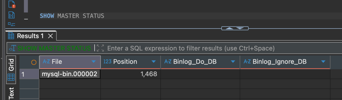
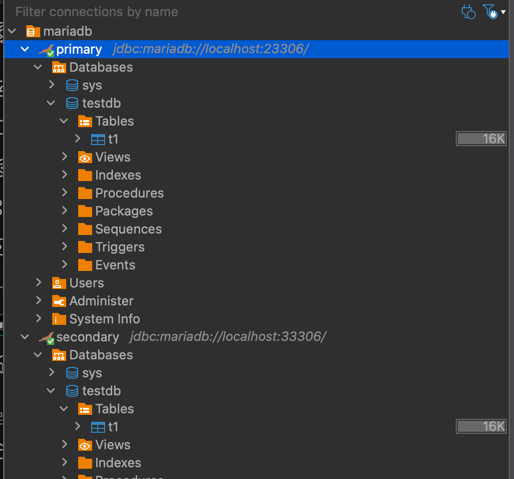

primary / secondary 셋팅
도커 최초 기동후

primary 에서

1. primary에서 복제 계정 생성
```
CREATE USER 'repl'@'%' IDENTIFIED BY 'replpass';
GRANT REPLICATION SLAVE ON *.* TO 'repl'@'%';
FLUSH PRIVILEGES;
```

2. primary에서 master 바이너리 확인
```
SHOW MASTER STATUS
```


3. secondary에서 master 정보 동기화
- 복제 계정 정보와 LOG FILE 및 position 정보를 맞춘다. 

```
CHANGE MASTER TO
MASTER_HOST='mariadb-primary',
MASTER_USER='repl',
MASTER_PASSWORD='replpass',
MASTER_LOG_FILE='mysql-bin.000002',
MASTER_LOG_POS=1468;

```
4. secondary에서 slave start
```
START SLAVE;
SHOW SLAVE STATUS;
```
셋팅 끝
 
### TEST
---
Primary에서 해당 쿼리 실행
```
CREATE DATABASE testdb;
USE testdb;
CREATE TABLE t1(id INT PRIMARY KEY AUTO_INCREMENT, name VARCHAR(20));
INSERT INTO t1(name) VALUES('hello');
```

Secondary에서 확인



귀찮으니 도커 shell로 정리해두자
```
#  Replication 전용 계정 생성
docker exec -it mariadb-primary mysql -uroot -prootpass -e "
CREATE USER 'repl'@'%' IDENTIFIED BY 'replpass';
GRANT REPLICATION SLAVE ON *.* TO 'repl'@'%';
FLUSH PRIVILEGES;"

# Primary Binary Log 위치 추출
docker exec -it mariadb-primary mysql -uroot -prootpass -e "SHOW MASTER STATUS\G"

#기록된 File/Position 값을 그대로 아래 Secondary 설정에 사용한다
# Secondary Replication

docker exec -it mariadb-secondary mysql -uroot -prootpass -e "
CHANGE MASTER TO
  MASTER_HOST='mariadb-primary',
  MASTER_USER='repl',
  MASTER_PASSWORD='replpass',
  MASTER_LOG_FILE='mysql-bin.000001',
  MASTER_LOG_POS=154;
START SLAVE;
"
docker exec -it mariadb-secondary mysql -uroot -prootpass -e "SHOW SLAVE STATUS\G"


# 복제 동작 테스트
## Primary에서 데이터 생성
docker exec -it mariadb-primary mysql -uroot -prootpass -e "
CREATE DATABASE testdb;
USE testdb;
CREATE TABLE t1(id INT PRIMARY KEY AUTO_INCREMENT, name VARCHAR(20));
INSERT INTO t1(name) VALUES('hello');
"

## Secondary에서 확인
docker exec -it mariadb-secondary mysql -uroot -prootpass -e "
SELECT * FROM testdb.t1;
"


```
