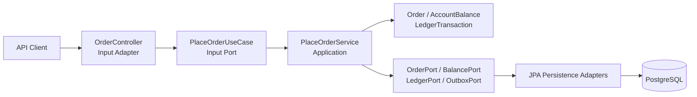
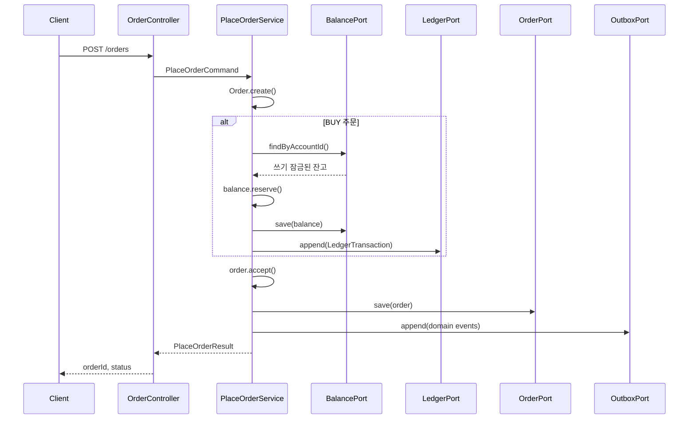

# Kotlin Trading Core

주문 접수와 자금 예약, 복식부기 원장, 아웃박스 이벤트를 하나의 트랜잭션으로 처리하는 Kotlin/Spring Boot 예제 프로젝트입니다. 도메인과 영속성 구현을 포트와 어댑터로 분리한 헥사고널 구조를 사용합니다.

## 주요 기능

- 매수/매도 지정가 주문 접수와 상태 전이
- 매수 주문 금액의 가용 잔고 예약
- 차변과 대변이 일치하는 복식부기 원장 기록
- 주문 도메인 이벤트를 아웃박스에 저장
- 잔고 행에 대한 비관적 쓰기 잠금으로 동시 주문의 초과 예약 방지

## 기술 스택

- Kotlin 2.2, Java 21
- Spring Boot 4, Spring Data JPA
- PostgreSQL 17
- Kotest BehaviorSpec, Cucumber JVM, JUnit Platform

## 구조

```text
src/main/kotlin/com/revy/trading
├── domain                  # 주문, 잔고, 원장 도메인 규칙
├── application/port        # 유스케이스와 입·출력 포트
├── adapter/output          # JPA 영속성 어댑터
├── controller              # 주문 HTTP API
└── config                  # JPA 설정

src/test
├── kotlin/.../domain       # Kotest BehaviorSpec 도메인 테스트
├── kotlin/...              # Cucumber runner와 step definitions
└── resources/features      # 한글 Gherkin 인수 시나리오
```

## 아키텍처

핵심 도메인이 HTTP나 JPA 같은 외부 기술에 의존하지 않도록 헥사고널 아키텍처를 적용했습니다. 의존성은 외부 어댑터에서 애플리케이션과 도메인 방향으로 향합니다.



| 계층 | 책임 |
| --- | --- |
| `controller` | HTTP 요청을 입력 포트의 명령으로 변환하고 결과를 응답으로 변환 |
| `application` | 주문 접수 유스케이스를 조정하고 하나의 트랜잭션 경계를 제공 |
| `domain` | 주문 상태 전이, 잔고 예약, 복식부기 균형 같은 핵심 규칙을 유지 |
| `application.port.output` | 영속성에 필요한 기능을 인터페이스로 정의 |
| `adapter.output.persistence` | 출력 포트를 JPA로 구현하고 도메인과 엔티티를 변환 |

### 주문 접수 흐름

`POST /orders` 요청은 다음 순서로 처리됩니다.



1. `OrderController`가 HTTP 요청을 `PlaceOrderCommand`로 변환합니다.
2. `PlaceOrderService`가 `Order.create()`로 `CREATED` 주문과 생성 이벤트를 만듭니다.
3. 매수 주문이면 `지정가 × 수량`을 계산하고 계정 잔고를 조회해 예약합니다. 매도 주문은 현금 예약과 원장 기록을 건너뜁니다.
4. 매수 예약 금액을 `AVAILABLE_CASH`의 대변과 `RESERVED_CASH`의 차변으로 기록합니다. `LedgerTransaction`은 차변과 대변의 합이 다르면 생성되지 않습니다.
5. 주문을 `ACCEPTED`로 전이하고 주문과 도메인 이벤트를 각각 주문 테이블과 아웃박스에 저장합니다.
6. 모든 저장은 `PlaceOrderService.place()`의 하나의 트랜잭션에서 실행됩니다. 중간 단계가 실패하면 잔고, 원장, 주문, 아웃박스 변경이 함께 롤백됩니다.

### 동시성과 이벤트 일관성

- `BalancePersistenceAdapter` 조회는 `PESSIMISTIC_WRITE` 잠금을 사용합니다. 동일 계정의 동시 매수 주문을 직렬화해 잔고보다 많은 금액이 예약되는 것을 방지합니다.
- 주문과 잔고 엔티티는 낙관적 동시성 검출을 위한 JPA `@Version`을 포함합니다.
- 도메인 이벤트는 주문과 같은 트랜잭션에서 아웃박스에 저장됩니다. 현재 범위는 아웃박스 저장까지이며, 외부 브로커로 발행하는 처리는 포함하지 않습니다.

## 실행

필요 환경은 Java 21과 Docker입니다.

```bash
docker compose up -d
./gradlew bootRun
```

서버는 기본적으로 `http://localhost:8080`에서 실행됩니다. Swagger UI는 `http://localhost:8080/swagger-ui.html`에서 확인할 수 있습니다.

### 주문 접수 예시

```bash
curl -X POST http://localhost:8080/orders \
  -H 'Content-Type: application/json' \
  -d '{
    "accountId": "00000000-0000-0000-0000-000000000001",
    "symbol": "AAPL",
    "side": "BUY",
    "quantity": 10,
    "limitPrice": 200
  }'
```

매수 주문을 접수하려면 `account_balance` 테이블에 해당 계정의 USD 잔고가 미리 존재해야 합니다.

## 테스트

### 컴파일과 전체 테스트

```bash
./gradlew clean compileKotlin compileTestKotlin test
```

`./gradlew test`만 실행해도 필요한 컴파일과 전체 테스트가 함께 실행됩니다.

### 테스트 구성

| 레이어 | 도구 | 검증 범위 |
| --- | --- | --- |
| 도메인 단위 테스트 | Kotest `BehaviorSpec` | 잔고 초과 예약, 주문 과다 체결 등 도메인 불변식 |
| 인수 테스트 | Cucumber + Gherkin | 잔고 예약, 동시 예약, 주문 승인과 부분 체결 |

Cucumber feature는 `src/test/resources/features`, step definition은 `TradingStepDefinitions.kt`에서 관리합니다. JUnit Platform이 Kotest와 Cucumber 엔진을 한 번의 Gradle `test` 작업으로 실행합니다.

### HTML 테스트 결과

테스트 실행 후 다음 HTML 리포트가 생성됩니다.

- 전체 Kotest + Cucumber 결과: `build/reports/tests/test/index.html`
- Cucumber feature 결과: `build/reports/cucumber/cucumber.html`
