# Revy(원량훈) 포트폴리오 - Core Banking

## DEMO 주소 정보

- WEB-ADMIN : [https://demo-admin.revy-won.dev/](https://demo-admin.revy-won.dev/)
- WEB-SAAS : [https://demo.revy-won.dev/](https://demo.revy-won.dev/)
- Github(포트폴리오 소스)  : [https://github.com/wantedhooni/portfolio/tree/develop/core-banking](https://github.com/wantedhooni/portfolio/tree/develop/core-banking)
- Github  : [https://github.com/wantedhooni/](https://github.com/wantedhooni/)
- blog : [https://revy.notion.site/Revy-Logs-or-audit-2cf8f9e43b5f8034a60ff8b40019c0ca](https://revy.notion.site/Revy-Logs-or-audit-2cf8f9e43b5f8034a60ff8b40019c0ca)

---

## 1. 프로젝트 개요

`Revy Core Banking`은 인터넷전문은행을 가정한 풀스택 코어뱅킹 포트폴리오 프로젝트다. 백엔드는 Spring Boot 멀티모듈 구조로 계좌, 거래, 주식, 주문, 포트폴리오, 외환, 보험, 원장, 청구, 정산, 스케줄러를 분리했고, 프론트엔드는 관리자 콘솔과 사용자 SaaS 화면을 Next.js로 분리했다.

| 구분 | 내용 |
|---|---|
| 백엔드 | Java 25, Spring Boot 4, Gradle 멀티모듈, JPA, QueryDSL, Flyway, Spring Security, JWT, Redis |
| 프론트엔드 | Next.js 16, React 19, TypeScript, Tailwind CSS, shadcn/ui, Axios |
| 데이터베이스 | PostgreSQL, Flyway migration |
| 캐시/세션 | Redis refresh token 저장 |
| 앱 구성 | `api-admin`, `api-saas`, `server-executor`, `web-admin`, `web-saas` |
| 운영 스택 | Pgpool-II, PostgreSQL Primary/Secondary, Redis, ELK, Prometheus/Grafana |

### 최근 작업에서 중점적으로 본 부분

이번 업데이트에서는 “기능이 많다”보다 “운영 가능한 금융 시스템처럼 책임이 나뉘어 있는가”를 기준으로 다시 정리했다. 외환은 현재 환율만 저장하는 구조에서 환율 이력과 통화 회랑까지 분리했고, 스케줄러는 관리자 API가 직접 실행까지 맡지 않도록 `server-executor`를 별도 워커로 뺐다. 이 두 지점은 포트폴리오에서 단순 CRUD를 넘어 운영 통제, 감사 추적, 실행 책임 분리를 보여주는 부분이다. 외부 환율 수집 클라이언트(`frankfurter-client`)는 Frankfurter v2 API 스펙에 맞춰 전면 리팩토링하고, `getLatestRates(base)` 메서드로 설정 변경 없이 전체 통화쌍을 자동 수집하는 `ExchangeRateRefreshService.refreshAll()`을 추가했다. 이 서비스는 `server-executor`에서 Quartz Job으로 실행된다.

### 프론트엔드 화면 - web-admin

운영자 콘솔은 도메인별 백오피스 업무를 서버사이드 검색, 페이지네이션, 등록/수정/삭제 액션이 포함된 공통 CRUD 화면으로 구성했다.

**관리자 로그인**

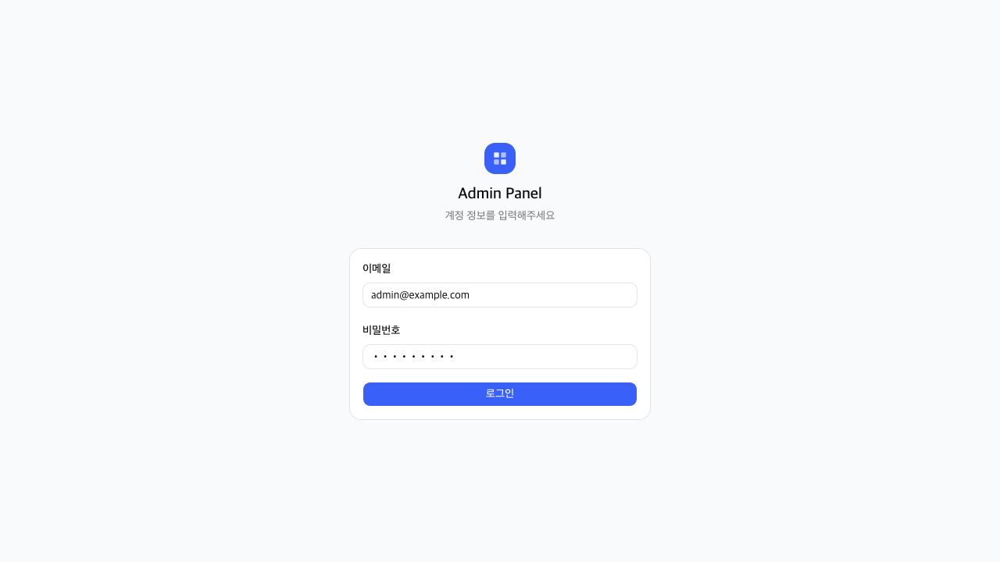

**운영자 대시보드**

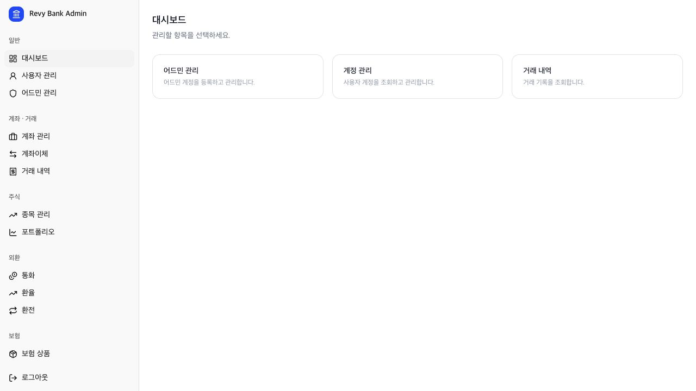

**계좌 관리 - 대용량 계좌 데이터 그리드**


**종목 관리 - 증권 마스터 데이터 그리드**


### 프론트엔드 화면 - web-saas

사용자 워크스페이스는 계좌, 이체, 환전, 보험, 거래, 종목 조회를 하나의 금융 업무 셸에서 이동하도록 구성했다.

**사용자 로그인**

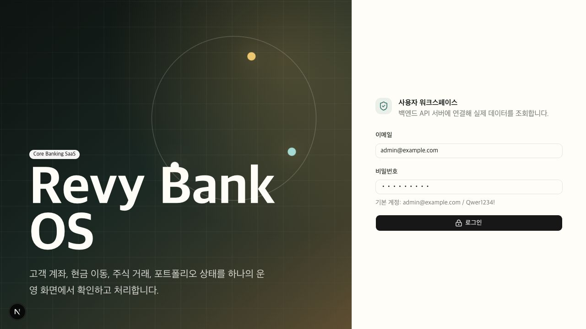

**서비스 가입**

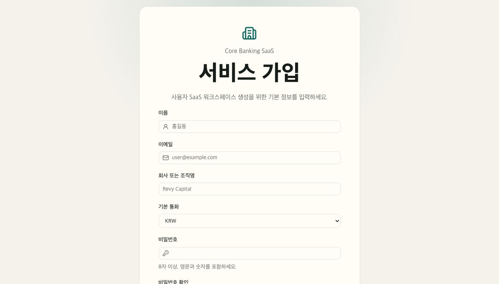

**워크스페이스 대시보드**

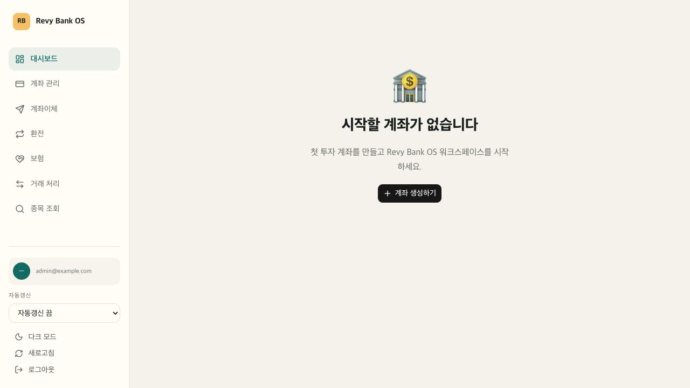

**계좌이체 업무 화면**

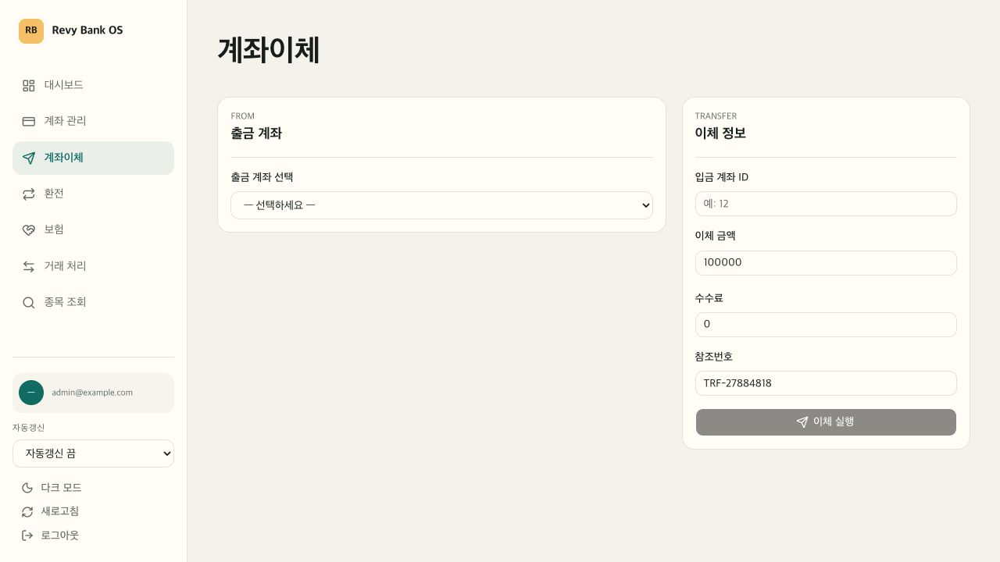

### INFRA

**Grafana**
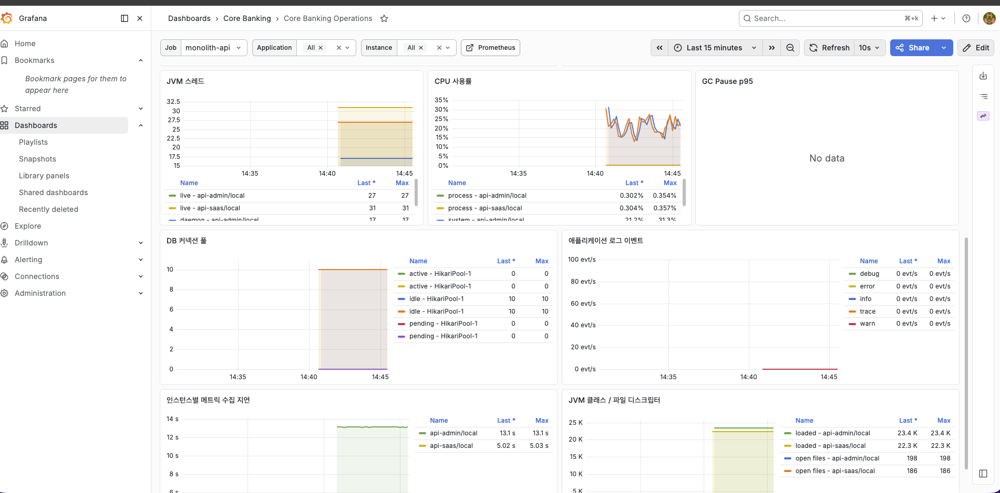

**ELK(KIBANA) 로그 모니터링**
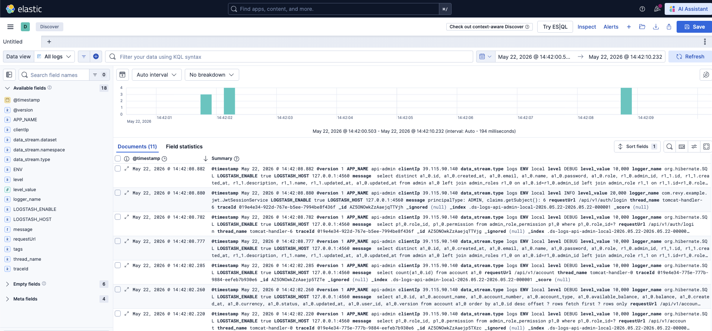

### 인프라스트럭처 다이어그램

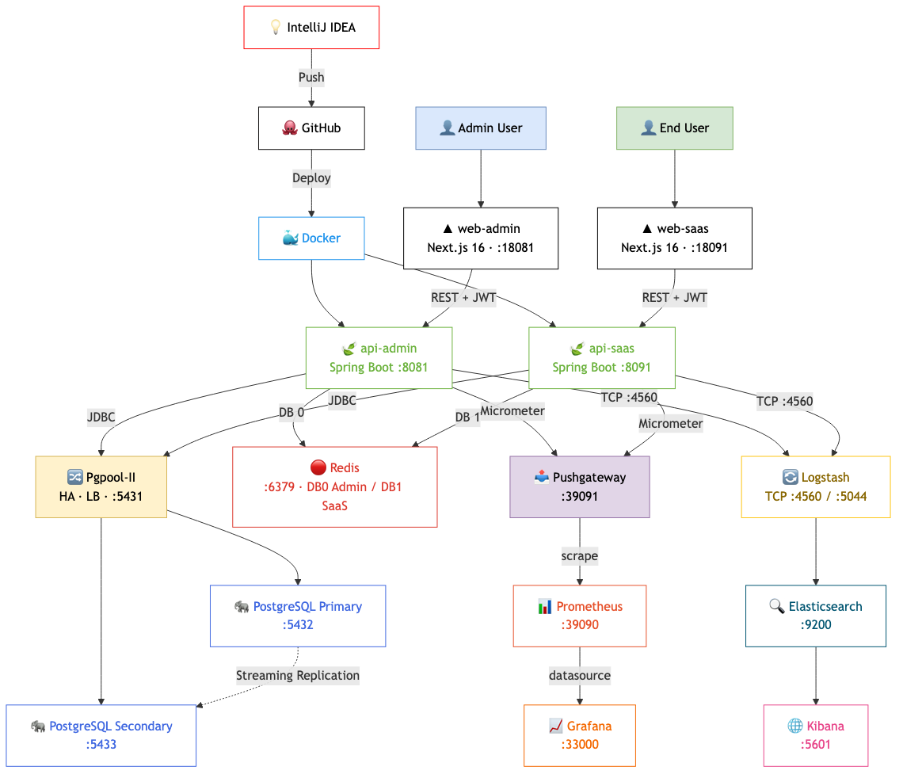

---


## 2. 백엔드 모듈 구조

```text
backend/
├── module/
│   ├── core/
│   │   ├── common          # BigDecimalUtil, UuidUtil 등 공통 utils
│   │   ├── core-domain     # BaseEntity
│   │   ├── core-exception  # BusinessException, ErrorCode
│   │   └── core-web        # 예외 처리, 웹 공통 설정
│   ├── domain              # Account, User, Stock, Order, FX, Insurance, Ledger, Billing 엔티티
│   ├── business-logic      # Reader/Command 기반 도메인 유스케이스 구현
│   ├── jwt-auth            # JWT 발급, 검증, principal 처리
│   ├── quartz-batch        # Quartz / Spring Batch 공통·관리·실행 모듈
│   ├── external-api        # Frankfurter 환율 API, Kafka client
│   └── tools               # metrics, log-elk
└── application/
    ├── api-admin           # 관리자 API, 기본 포트 8081
    ├── api-saas            # 사용자 API, 기본 포트 8091
    └── server-executor     # Quartz Trigger 실행 워커, 기본 포트 8071
```

아래 다이어그램의 화살표는 `의존 대상 -> 사용하는 모듈` 방향이다.

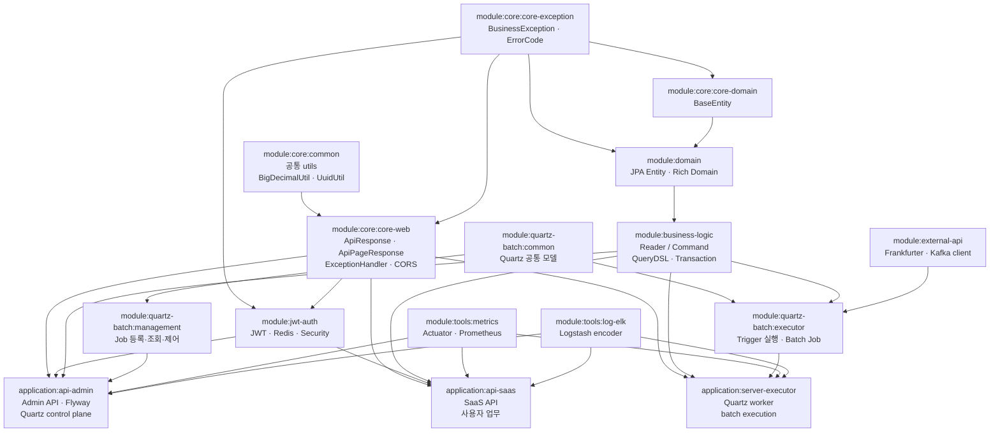
```mermaid
flowchart TD
    common["module:core:common<br/>공통 utils<br/>BigDecimalUtil · UuidUtil"]
    exception["module:core:core-exception<br/>BusinessException · ErrorCode"]
    coreDomain["module:core:core-domain<br/>BaseEntity"]
    web["module:core:core-web<br/>ApiResponse · ApiPageResponse<br/>ExceptionHandler · CORS"]
    domain["module:domain<br/>JPA Entity · Rich Domain"]
    logic["module:business-logic<br/>Reader / Command<br/>QueryDSL · Transaction"]
    jwt["module:jwt-auth<br/>JWT · Redis · Security"]
    quartzCommon["module:quartz-batch:common<br/>Quartz 공통 모델"]
    quartzMgmt["module:quartz-batch:management<br/>Job 등록·조회·제어"]
    quartzExec["module:quartz-batch:executor<br/>Trigger 실행 · Batch Job"]
    external["module:external-api<br/>Frankfurter · Kafka client"]
    metrics["module:tools:metrics<br/>Actuator · Prometheus"]
    logelk["module:tools:log-elk<br/>Logstash encoder"]
    admin["application:api-admin<br/>Admin API · Flyway<br/>Quartz control plane"]
    saas["application:api-saas<br/>SaaS API<br/>사용자 업무"]
    executor["application:server-executor<br/>Quartz worker<br/>batch execution"]

    common --> web
    exception --> web
    exception --> coreDomain
    exception --> domain
    coreDomain --> domain
    domain --> logic
    exception --> jwt
    web --> jwt
    quartzCommon --> quartzMgmt
    quartzCommon --> quartzExec
    logic --> quartzExec
    external --> quartzExec

    web --> admin
    jwt --> admin
    logic --> admin
    quartzMgmt --> admin
    metrics --> admin
    logelk --> admin

    web --> saas
    jwt --> saas
    logic --> saas
    metrics --> saas
    logelk --> saas

    web --> executor
    logic --> executor
    quartzExec --> executor
    metrics --> executor
    logelk --> executor
```

### 실제 Gradle 의존성

| 모듈 | 직접 의존 모듈 | 역할 |
|---|---|---|
| `module:core:common` | 없음 | 공통 utils. `BigDecimalUtil`, `UuidUtil` |
| `module:core:core-exception` | 없음 | 업무 예외와 에러 코드 |
| `module:core:core-domain` | `core-exception` | `BaseEntity`와 엔티티 공통 기반 |
| `module:core:core-web` | `core-common`, `core-exception` | 공통 응답, 전역 예외 처리, CORS/OpenAPI/Validation 공통 |
| `module:domain` | `core-exception`, `core-domain` | JPA 엔티티, enum, 도메인 예외, Rich Domain 로직 |
| `module:business-logic` | `domain` | QueryDSL Reader, 트랜잭션 Command, DTO 경계 |
| `module:jwt-auth` | `core-exception`, `core-web` | JWT 발급/검증, Redis refresh token, Security 필터 지원 |
| `module:quartz-batch:quartz-batch-common` | 없음 | Quartz Job/Trigger 공통 모델과 상태 코드 |
| `module:quartz-batch:quartz-batch-management` | `quartz-batch-common` | Job 등록·수정·삭제, 실행 이력 조회, pause/resume/runNow 제어 |
| `module:quartz-batch:quartz-batch-executor` | `quartz-batch-common`, `business-logic`, `external-api:frankfurter-client` | Trigger 발화, Batch Job 실행, `ExchangeRateRefreshService.refresh()` / `refreshAll()` 환율 수집 |
| `module:external-api:frankfurter-client` | 없음 | Frankfurter **v2** 환율 API RestClient — `getLatestRates(base)`(전체 통화), `getRates(FrankfurterRatesRequest)`(날짜 범위·그룹), `getCurrency(code)`, `getProviders()` |
| `module:external-api:kafka-client` | 없음 | Kafka producer/consumer 공통 설정 후보 모듈 |
| `module:tools:metrics` | 없음 | Actuator, Prometheus, Pushgateway 연동 |
| `module:tools:log-elk` | 없음 | Logstash encoder 기반 로그 전송 |
| `application:api-admin` | `core-web`, `jwt-auth`, `business-logic`, `quartz-batch-management`, `metrics`, `log-elk` | 운영자 API, Flyway, 운영/정산/Quartz 제어 조립 |
| `application:api-saas` | `core-web`, `jwt-auth`, `business-logic`, `metrics`, `log-elk` | 사용자 API와 본인 계좌 중심 업무 조립 |
| `application:server-executor` | `core-web`, `business-logic`, `quartz-batch-executor`, `metrics`, `log-elk` | Quartz Trigger 실행·Batch Job 처리 워커 (`ExchangeRateRefreshService`를 Quartz Job으로 실행해 Frankfurter 환율 수집) |

### 백엔드 설계 포인트

| 영역 | 설계 |
|---|---|
| 계층 분리 | Application Controller는 payload/usecase 중심, 도메인 엔티티 직접 노출 최소화 |
| 조회/변경 분리 | Reader는 조회, Command는 상태 변경과 트랜잭션 책임 |
| 인증 | Admin/SaaS 별도 JWT issuer와 Redis DB 사용 |
| 데이터 정합성 | 계좌 입출금/이체, 주식 매매, 환전, 보험료 납부는 단일 트랜잭션에서 처리 |
| 감사 추적 | `referenceId`, 거래 내역, 원장 분개로 업무 이벤트 추적 |
| 운영 기능 | 청구/정산 상태 전이, RBAC, Quartz/Spring Batch 운영 API 제공 |

### 도메인 분석 요약

| 도메인 | 구현 관점 | 포트폴리오에서 보여줄 포인트 |
|---|---|---|
| 계좌/거래 | 잔고·가용잔고 분리, 입출금/이체 거래 기록, 낙관적 락 | 동시성, 멱등성, 소유권 검증 |
| 주식/주문/포지션 | 주문 접수·체결, 매수 Lot, FIFO 매도, 실현손익 계산 | 단순 CRUD를 넘어선 상태 전이와 자산 평가 |
| 외환 | 통화/환율 마스터, 환전 요청·완료, 계좌 출금/입금 연결 | 크로스 도메인 트랜잭션 |
| 보험 | 상품, 증권, 수익자, 보험료, 청구 심사/지급 | 긴 생명주기의 업무 상태 모델링 |
| 원장 | 계정과목, 회계기간, 분개, 역분개, 시산표 | 복식부기 균형 검증과 감사 추적 |
| 청구/정산 | 청구서 발행·결제·연체, 정산 성공/실패 | 운영 백오피스 업무 흐름 |
| RBAC/스케줄러 | 관리자 역할·권한, Quartz/Batch 조회·제어 | 운영자 콘솔의 실무 기능 |

## 3. 프론트엔드 디자인 구조

```text
frontned/
├── web-admin/
│   └── src/
│       ├── app/(auth)/login
│       ├── app/(dashboard)/dashboard
│       ├── components/data-grid    # CrudPage, DataGrid, Modal, SearchBar
│       ├── features                # 도메인별 CRUD config
│       ├── lib                     # API client, auth store
│       └── services                # CRUD service
└── web-saas/
    └── src/
        ├── app/login, signup
        ├── app/workspace           # 계좌, 이체, 주식, 거래, 외환, 보험
        ├── features                # 도메인별 service/type/component
        ├── shared                  # API client, auth token, 공통 타입
        └── workspace               # Sidebar, TopNav, Provider
```

### 화면 설계

| 앱 | 핵심 화면 | 목적 |
|---|---|---|
| web-admin | Dashboard | 운영 지표와 관리 메뉴 진입 |
| web-admin | 계좌/거래/사용자/관리자 | 서버사이드 페이지네이션 기반 CRUD 관리 |
| web-admin | FX/보험/원장/청구/정산/스케줄러 | 환율, 보험 증권/청구, 계정과목/분개/시산표, 청구서, 정산, 배치 운영 |
| web-saas | Workspace | 사용자의 금융 활동 허브 |
| web-saas | Accounts/Transfer | 계좌 개설, 잔고 확인, 입출금, 이체 |
| web-saas | Stocks/Trades/Portfolio | 종목 조회, 매매, 포트폴리오 평가 |
| web-saas | FX/Insurance/Billing | 환전, 보험 상품 조회, 가입, 청구, 청구서 결제 |

## 4. 백엔드 플로우

### 인증 플로우

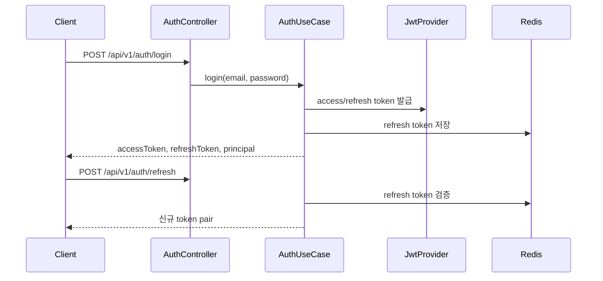
```mermaid
sequenceDiagram
    participant Client
    participant AuthController
    participant AuthUseCase
    participant JwtProvider
    participant Redis

    Client->>AuthController: POST /api/v1/auth/login
    AuthController->>AuthUseCase: login(email, password)
    AuthUseCase->>JwtProvider: access/refresh token 발급
    AuthUseCase->>Redis: refresh token 저장
    AuthUseCase-->>Client: accessToken, refreshToken, principal
    Client->>AuthController: POST /api/v1/auth/refresh
    AuthUseCase->>Redis: refresh token 검증
    AuthUseCase-->>Client: 신규 token pair
```

### 계좌 이체 플로우

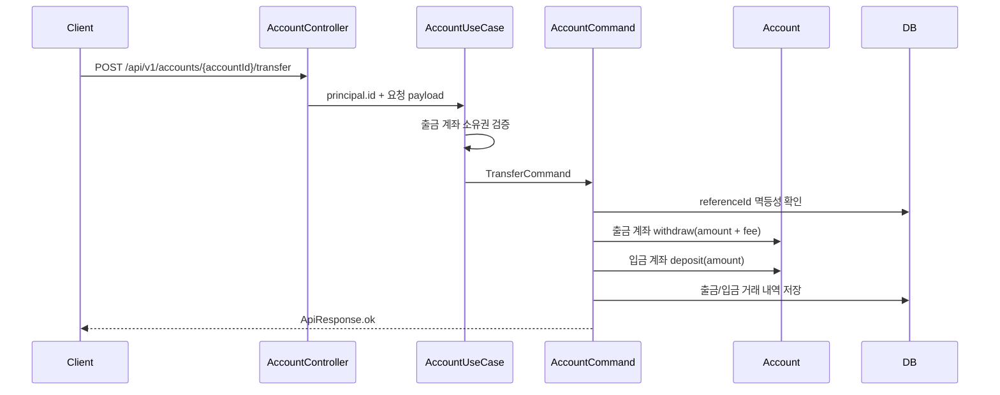
```mermaid
sequenceDiagram
    participant Client
    participant AccountController
    participant AccountUseCase
    participant AccountCommand
    participant Account
    participant DB

    Client->>AccountController: POST /api/v1/accounts/{accountId}/transfer
    AccountController->>AccountUseCase: principal.id + 요청 payload
    AccountUseCase->>AccountUseCase: 출금 계좌 소유권 검증
    AccountUseCase->>AccountCommand: TransferCommand
    AccountCommand->>DB: referenceId 멱등성 확인
    AccountCommand->>Account: 출금 계좌 withdraw(amount + fee)
    AccountCommand->>Account: 입금 계좌 deposit(amount)
    AccountCommand->>DB: 출금/입금 거래 내역 저장
    AccountCommand-->>Client: ApiResponse.ok
```

### 주식 매매 플로우

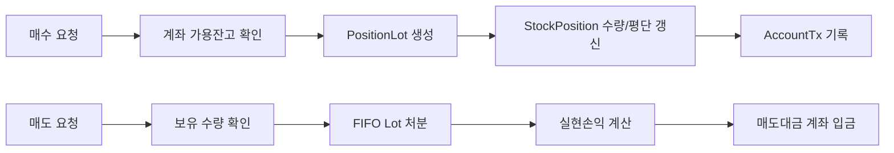
```mermaid
flowchart LR
    buy["매수 요청"] --> cash["계좌 가용잔고 확인"]
    cash --> lot["PositionLot 생성"]
    lot --> position["StockPosition 수량/평단 갱신"]
    position --> tx["AccountTx 기록"]

    sell["매도 요청"] --> owned["보유 수량 확인"]
    owned --> fifo["FIFO Lot 처분"]
    fifo --> pnl["실현손익 계산"]
    pnl --> deposit["매도대금 계좌 입금"]
```

### Quartz 실행 플로우 — api-admin / server-executor 역할 분리

두 애플리케이션은 같은 PostgreSQL Quartz Metastore를 바라보되, **관리 노드(api-admin)**와 **실행 노드(server-executor)**로 책임이 분리된다.

| 관심사 | api-admin | server-executor |
|---|---|---|
| Job 등록·수정·삭제 | O (`QuartzJobHandler`) | X |
| pause / resume / runNow / retry | O | X |
| Trigger 발화 | X | O (Quartz Scheduler polling) |
| 실제 Job 클래스 보유 | X (`EmptyJobClassRegistry`) | O (`TypedJobRegistryConfig`) |
| 실행 이력 조회 | O | — (리스너가 저장) |

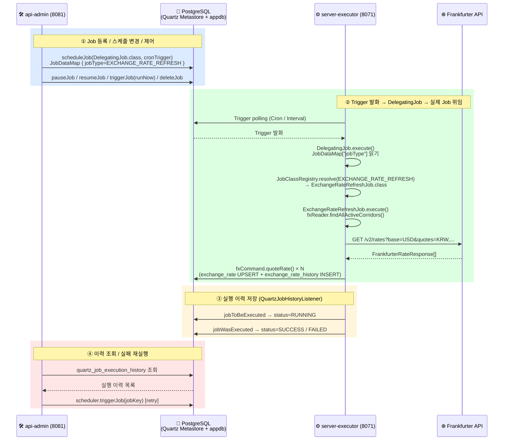
```mermaid
sequenceDiagram
    participant Admin  as 🛠 api-admin (8081)
    participant DB     as 💾 PostgreSQL<br/>(Quartz Metastore + appdb)
    participant Exec   as ⚙ server-executor (8071)
    participant FX     as 🌐 Frankfurter API

    rect rgb(220,235,255)
        Note over Admin,DB: ① Job 등록 / 스케줄 변경 / 제어
        Admin->>DB: scheduleJob(DelegatingJob.class, cronTrigger)<br/>JobDataMap { jobType=EXCHANGE_RATE_REFRESH }
        Admin->>DB: pauseJob / resumeJob / triggerJob(runNow) / deleteJob
    end

    rect rgb(220,255,225)
        Note over Exec,FX: ② Trigger 발화 → DelegatingJob → 실제 Job 위임
        Exec->>DB: Trigger polling (Cron / Interval)
        DB-->>Exec: Trigger 발화
        Exec->>Exec: DelegatingJob.execute()<br/>JobDataMap["jobType"] 읽기
        Exec->>Exec: JobClassRegistry.resolve(EXCHANGE_RATE_REFRESH)<br/>→ ExchangeRateRefreshJob.class
        Exec->>Exec: ExchangeRateRefreshJob.execute()<br/>fxReader.findAllActiveCorridors()
        Exec->>FX: GET /v2/rates?base=USD&quotes=KRW,...
        FX-->>Exec: FrankfurterRateResponse[]
        Exec->>DB: fxCommand.quoteRate() × N<br/>(exchange_rate UPSERT + exchange_rate_history INSERT)
    end

    rect rgb(255,245,220)
        Note over Exec,DB: ③ 실행 이력 저장 (QuartzJobHistoryListener)
        Exec->>DB: jobToBeExecuted → status=RUNNING
        Exec->>DB: jobWasExecuted  → status=SUCCESS / FAILED
    end

    rect rgb(255,230,230)
        Note over Admin,DB: ④ 이력 조회 / 실패 재실행
        Admin->>DB: quartz_job_execution_history 조회
        DB-->>Admin: 실행 이력 목록
        Admin->>DB: scheduler.triggerJob(jobKey) [retry]
    end
```

**핵심 설계:**
- `DelegatingJob` — 항상 이 클래스명으로 Quartz DB에 저장. api-admin은 실제 Job 클래스를 몰라도 등록 가능.
- `JobClassRegistry` — server-executor에서만 `TypedJob` 빈을 수집해 `JobType → Class` 매핑 구축. api-admin에는 오류 반환 fallback만 존재.
- `QuartzJobHistoryListener` — server-executor가 Job 시작·완료·실패 시점에 커스텀 이력 테이블(`quartz_job_execution_history`)에 자동 저장.

## 5. 프론트엔드 플로우

### 공통 API 호출 흐름

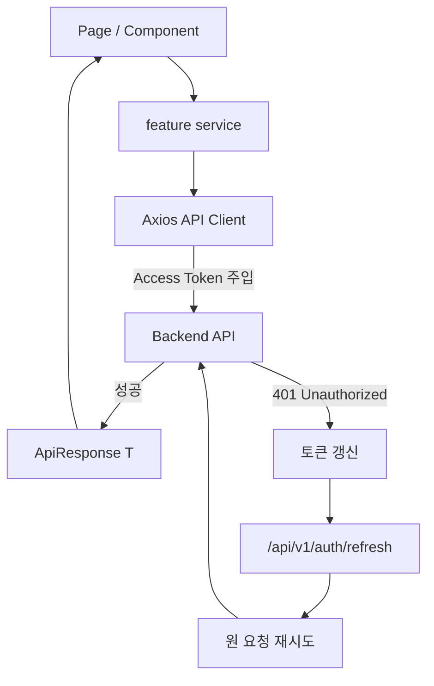
```mermaid
flowchart TD
    page["Page / Component"] --> service["feature service"]
    service --> axios["Axios API Client"]
    axios -->|Access Token 주입| api["Backend API"]
    api -->|성공| response["ApiResponse T"]
    response --> page
    api -->|401 Unauthorized| refresh["토큰 갱신"]
    refresh --> refreshApi["/api/v1/auth/refresh"]
    refreshApi --> retry["원 요청 재시도"]
    retry --> api
```

### web-admin CRUD 흐름

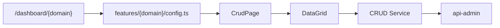
```mermaid
flowchart LR
    route["/dashboard/{domain}"] --> config["features/{domain}/config.ts"]
    config --> crud["CrudPage"]
    crud --> grid["DataGrid"]
    grid --> service["CRUD Service"]
    service --> adminApi["api-admin"]
```

### web-saas 워크스페이스 흐름

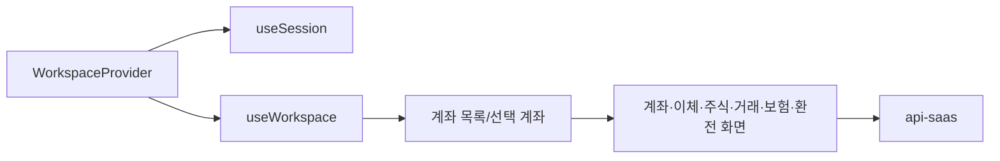
```mermaid
flowchart LR
    layout["WorkspaceProvider"] --> session["useSession"]
    layout --> workspace["useWorkspace"]
    workspace --> accounts["계좌 목록/선택 계좌"]
    accounts --> feature["계좌·이체·주식·거래·보험·환전 화면"]
    feature --> saasApi["api-saas"]
```

## 6. 인프라 구성도

이 프로젝트는 로컬 **Docker Compose 기반으로 운영 환경을 재현**한다. 프론트엔드(Next.js 2개) → 백엔드(Spring Boot API 2개 + Executor 1개) → 데이터 계층(pgpool+PostgreSQL HA, Redis) → 관측성 스택(ELK, Prometheus+Grafana)으로 구성된다. 4개의 Docker Compose 스택이 독립적으로 기동되어 필요한 영역만 선택적으로 실행할 수 있다.

### 6.1 전체 시스템 아키텍처 (논리 계층)

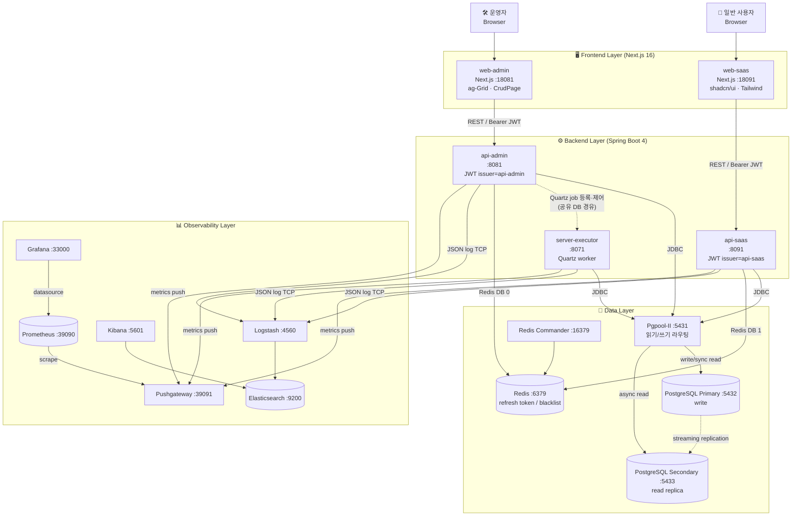
```mermaid
flowchart TB
    user["👤 일반 사용자<br/>Browser"]
    adminUser["🛠 운영자<br/>Browser"]

    subgraph Frontend["🖥 Frontend Layer (Next.js 16)"]
        webSaas["web-saas<br/>Next.js :18091<br/>shadcn/ui · Tailwind"]
        webAdmin["web-admin<br/>Next.js :18081<br/>ag-Grid · CrudPage"]
    end

    subgraph Backend["⚙ Backend Layer (Spring Boot 4)"]
        apiSaas["api-saas<br/>:8091<br/>JWT issuer=api-saas"]
        apiAdmin["api-admin<br/>:8081<br/>JWT issuer=api-admin"]
        executor["server-executor<br/>:8071<br/>Quartz worker"]
    end

    subgraph Data["💾 Data Layer"]
        direction LR
        pgpool["Pgpool-II :5431<br/>읽기/쓰기 라우팅"]
        primary[("PostgreSQL Primary :5432<br/>write")]
        secondary[("PostgreSQL Secondary :5433<br/>read replica")]
        redis[("Redis :6379<br/>refresh token / blacklist")]
        redisCommander["Redis Commander :16379"]
    end

    subgraph Obs["📊 Observability Layer"]
        direction LR
        logstash["Logstash :4560"]
        elastic[("Elasticsearch :9200")]
        kibana["Kibana :5601"]
        pushgateway["Pushgateway :39091"]
        prometheus[("Prometheus :39090")]
        grafana["Grafana :33000"]
    end

    user --> webSaas
    adminUser --> webAdmin

    webSaas -->|REST / Bearer JWT| apiSaas
    webAdmin -->|REST / Bearer JWT| apiAdmin

    apiSaas -->|JDBC| pgpool
    apiAdmin -->|JDBC| pgpool
    executor -->|JDBC| pgpool
    pgpool -->|write/sync read| primary
    pgpool -->|async read| secondary
    primary -.->|streaming replication| secondary

    apiAdmin -.->|"Quartz job 등록·제어<br/>(공유 DB 경유)"| executor

    apiSaas -->|Redis DB 1| redis
    apiAdmin -->|Redis DB 0| redis
    redisCommander --> redis

    apiSaas -->|JSON log TCP| logstash
    apiAdmin -->|JSON log TCP| logstash
    executor -->|JSON log TCP| logstash
    logstash --> elastic
    kibana --> elastic

    apiSaas -->|metrics push| pushgateway
    apiAdmin -->|metrics push| pushgateway
    executor -->|metrics push| pushgateway
    prometheus -->|scrape| pushgateway
    grafana -->|datasource| prometheus
```

### 6.2 Docker Compose 스택 구성

4개의 독립적인 Docker Compose 파일이 인프라를 구성한다. 애플리케이션 코드(`api-admin`, `api-saas`, `server-executor`, `web-admin`, `web-saas`)는 호스트(또는 별도 컨테이너)에서 실행되어 도커 네트워크 외부에서 접근한다.

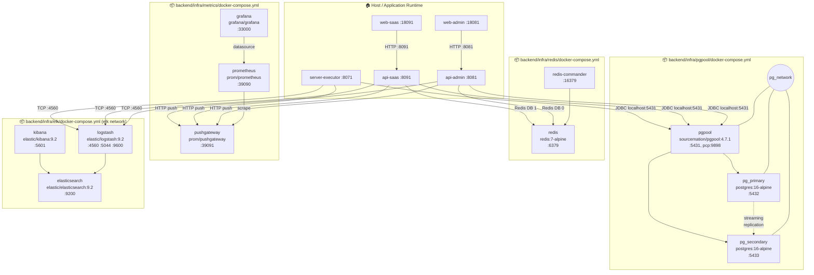
```mermaid
flowchart TB
    subgraph HostApps["🏠 Host / Application Runtime"]
        webAdminApp["web-admin :18081"]
        webSaasApp["web-saas :18091"]
        apiAdminApp["api-admin :8081"]
        apiSaasApp["api-saas :8091"]
        executorApp["server-executor :8071"]
    end

    subgraph Compose1["📦 backend/infra/pgpool/docker-compose.yml"]
        direction TB
        pgNet(("pg_network"))
        pgPrimary["pg_primary<br/>postgres:16-alpine<br/>:5432"]
        pgSecondary["pg_secondary<br/>postgres:16-alpine<br/>:5433"]
        pgpoolSvc["pgpool<br/>sourcemation/pgpool:4.7.1<br/>:5431, pcp:9898"]
        pgNet --- pgPrimary
        pgNet --- pgSecondary
        pgNet --- pgpoolSvc
        pgPrimary -.->|"streaming<br/>replication"| pgSecondary
        pgpoolSvc --> pgPrimary
        pgpoolSvc --> pgSecondary
    end

    subgraph Compose2["📦 backend/infra/redis/docker-compose.yml"]
        direction TB
        redisSvc["redis<br/>redis:7-alpine<br/>:6379"]
        redisCmd["redis-commander<br/>:16379"]
        redisCmd --> redisSvc
    end

    subgraph Compose3["📦 backend/infra/metrics/docker-compose.yml"]
        direction TB
        pushGw["pushgateway<br/>prom/pushgateway<br/>:39091"]
        promSvc["prometheus<br/>prom/prometheus<br/>:39090"]
        grafSvc["grafana<br/>grafana/grafana<br/>:33000"]
        promSvc -->|scrape| pushGw
        grafSvc -->|datasource| promSvc
    end

    subgraph Compose4["📦 backend/infra/elk/docker-compose.yml (elk network)"]
        direction TB
        logSvc["logstash<br/>elastic/logstash:9.2<br/>:4560 :5044 :9600"]
        esSvc["elasticsearch<br/>elastic/elasticsearch:9.2<br/>:9200"]
        kibSvc["kibana<br/>elastic/kibana:9.2<br/>:5601"]
        logSvc --> esSvc
        kibSvc --> esSvc
    end

    apiAdminApp -->|JDBC localhost:5431| pgpoolSvc
    apiSaasApp  -->|JDBC localhost:5431| pgpoolSvc
    executorApp -->|JDBC localhost:5431| pgpoolSvc
    apiAdminApp -->|Redis DB 0| redisSvc
    apiSaasApp  -->|Redis DB 1| redisSvc
    apiAdminApp -->|TCP :4560| logSvc
    apiSaasApp  -->|TCP :4560| logSvc
    executorApp -->|TCP :4560| logSvc
    apiAdminApp -->|HTTP push| pushGw
    apiSaasApp  -->|HTTP push| pushGw
    executorApp -->|HTTP push| pushGw

    webAdminApp -->|HTTP :8081| apiAdminApp
    webSaasApp  -->|HTTP :8091| apiSaasApp
```

> **기동/중지 통합 스크립트** — `script/all-start.sh` → 4개 인프라 compose 기동 → 백엔드 API 2개와 Executor 1개 부팅 → 프론트엔드 2개 빌드·서빙

### 6.3 데이터 영속화 토폴로지 (Pgpool-II HA)

코어뱅킹 특성상 데이터 가용성이 중요하므로, PostgreSQL Primary-Secondary 복제 + Pgpool-II를 통한 자동 read/write 라우팅을 구성했다.

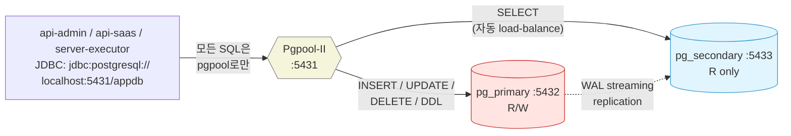
```mermaid
flowchart LR
    appA["api-admin / api-saas / server-executor<br/>JDBC: jdbc:postgresql://<br/>localhost:5431/appdb"]

    appA -->|"모든 SQL은<br/>pgpool로만"| pool

    pool{{"Pgpool-II<br/>:5431"}}

    pool -->|"INSERT / UPDATE /<br/>DELETE / DDL"| pri[("pg_primary :5432<br/>R/W")]
    pool -->|"SELECT<br/>(자동 load-balance)"| sec[("pg_secondary :5433<br/>R only")]
    pri -.->|"WAL streaming<br/>replication"| sec

    style pool fill:#f5f5dc,stroke:#888
    style pri fill:#ffe4e1,stroke:#c33
    style sec fill:#e1f5fe,stroke:#39c
```

- **앱은 pgpool만 바라본다** (`jdbc:postgresql://localhost:5431/appdb`). 노드 장애·교체 시에도 connection string 변경 불필요.
- **Flyway는 primary에 직접 작성** (pgpool 경유). DDL은 자동으로 secondary로 streaming replication.
- **운영 환경 적용 시**: Pgpool watchdog + HAProxy + replication lag 모니터링까지 확장 예정.

### 6.4 인증 / 세션 토폴로지 (Redis 분리)

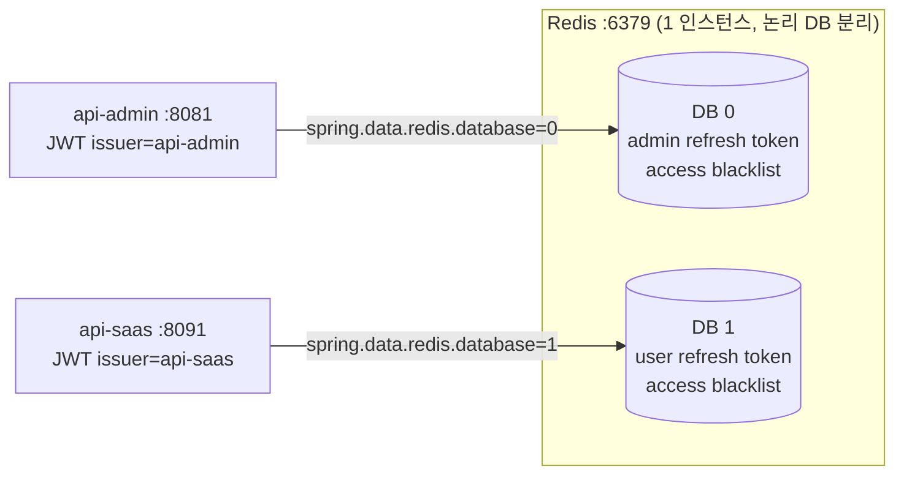
```mermaid
flowchart LR
    saas["api-saas :8091<br/>JWT issuer=api-saas"]
    admin["api-admin :8081<br/>JWT issuer=api-admin"]

    subgraph RedisInst["Redis :6379 (1 인스턴스, 논리 DB 분리)"]
        db0[("DB 0<br/>admin refresh token<br/>access blacklist")]
        db1[("DB 1<br/>user refresh token<br/>access blacklist")]
    end

    admin -->|spring.data.redis.database=0| db0
    saas  -->|spring.data.redis.database=1| db1
```

- **JWT issuer 분리**: 관리자 토큰이 사용자 API에서 검증되지 않도록 issuer claim을 다르게 한다.
- **Redis DB 분리**: 같은 Redis 인스턴스에서도 키 충돌·운영 실수 방지를 위해 DB index를 분리.
- **logout/refresh**: refresh token은 Redis에 저장, access token blacklist도 Redis로 즉시 무효화.

### 6.5 관측성 데이터 흐름

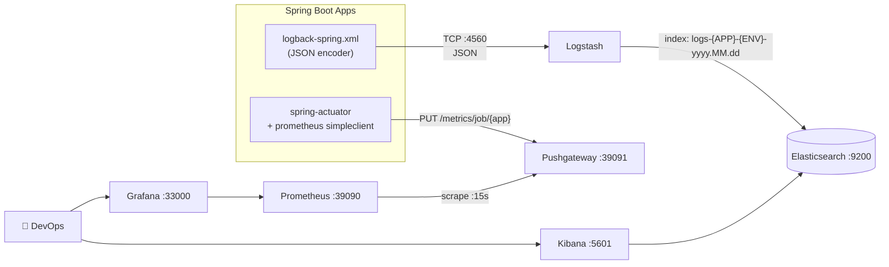
```mermaid
flowchart LR
    subgraph App["Spring Boot Apps"]
        logback["logback-spring.xml<br/>(JSON encoder)"]
        actuator["spring-actuator<br/>+ prometheus simpleclient"]
    end

    logback -->|"TCP :4560<br/>JSON"| ls["Logstash"]
    ls -->|"index: logs-{APP}-{ENV}-yyyy.MM.dd"| es[("Elasticsearch :9200")]
    kb["Kibana :5601"] --> es

    actuator -->|"PUT /metrics/job/{app}"| pg["Pushgateway :39091"]
    prom["Prometheus :39090"] -->|"scrape :15s"| pg
    gf["Grafana :33000"] --> prom

    devops["👤 DevOps"] --> kb
    devops --> gf
```

- **로그**: Logback이 logstash-encoder로 JSON 직렬화 → TCP appender로 Logstash 전송 → Elasticsearch 인덱싱.
- **메트릭**: 단명(short-lived) 작업도 누락 없이 수집하기 위해 Pushgateway 방식을 채택. Prometheus는 Pushgateway만 scrape.
- **시각화**: Kibana(로그 검색·분석), Grafana(시계열·SLO 대시보드)로 역할 분리.

### 6.6 포트 맵 (Port Map)

| 분류 | 컴포넌트 | 노출 포트 | 컨테이너 포트 | 비고 |
|---|---|---:|---:|---|
| **Frontend** | web-admin (Next.js) | **18081** | — | 운영자 콘솔 |
| | web-saas (Next.js) | **18091** | — | 사용자 워크스페이스 |
| **Backend** | api-admin (Spring Boot) | **8081** | — | 운영자 API, Swagger `/swagger-ui/index.html` |
| | api-saas (Spring Boot) | **8091** | — | 사용자 API, Swagger `/swagger-ui/index.html` |
| | server-executor (Spring Boot) | **8071** | — | Quartz Trigger 실행 워커 |
| **Database** | pgpool | **5431** | 5432 | 앱 단일 진입점 |
| | pg_primary | 5432 | 5432 | 쓰기 노드 |
| | pg_secondary | 5433 | 5432 | 읽기 복제 |
| | pgpool pcp | 9898 | 9898 | pgpool 관리 CLI |
| **Cache** | redis | **6379** | 6379 | DB0=admin · DB1=user |
| | redis-commander | **16379** | 8081 | Redis 관리 UI |
| **Logging** | logstash (TCP) | **4560** | 4560 | 앱 로그 입력 |
| | logstash (Beats) | 5044 | 5044 | (선택) |
| | logstash (Monitoring) | 9600 | 9600 | API |
| | elasticsearch | **9200** | 9200 | 로그 저장소 |
| | kibana | **5601** | 5601 | 로그 시각화 |
| **Metrics** | pushgateway | **39091** | 9091 | 메트릭 push |
| | prometheus | **39090** | 9090 | 메트릭 수집 |
| | grafana | **33000** | 3000 | 대시보드 (admin/admin) |

### 6.7 Compose 파일 ↔ 컨테이너 매핑

| Docker Compose 파일 | 네트워크 | 컨테이너 |
|---|---|---|
| `backend/infra/pgpool/docker-compose.yml` | `pg_network` | `pg_primary`, `pg_secondary`, `pgpool` |
| `backend/infra/redis/docker-compose.yml` | default | `redis`, `redis-commander` |
| `backend/infra/metrics/docker-compose.yml` | default | `pushgateway`, `prometheus`, `grafana` |
| `backend/infra/elk/docker-compose.yml` | `elk` | `elasticsearch`, `logstash`, `kibana` |

### 6.8 네트워크 / 운영 설계 포인트

- **DB 단일 진입점**: 애플리케이션은 PostgreSQL primary/secondary에 **직접 접속하지 않고** `pgpool:5431`만 사용한다. → 노드 교체 시 connection string 변경 불요.
- **Reader/Command 분리 + Pgpool**: 향후 hint(`/*NO LOAD BALANCE*/`)나 connection routing으로 `Reader` 트랜잭션을 secondary 노드로 강제 라우팅 가능.
- **인증 격리**: Admin/SaaS는 단일 Redis 인스턴스를 공유하되 DB index를 `0`, `1`로 분리. JWT issuer claim도 다르게 설정해 cross-app token 사용을 차단.
- **로그 일관성**: Spring `logback-spring.xml`이 JSON encoder로 직렬화하여 Logstash TCP input(`4560`)으로 전송. 인덱스 패턴은 `logs-{APP_NAME}-{ENV}-yyyy.MM.dd`로 앱·환경·일자 단위 검색 가능.
- **메트릭 수집 방식**: Spring Actuator + Prometheus simpleclient가 Pushgateway에 push → Prometheus가 Pushgateway를 scrape. 배치성 작업도 메트릭 누락 없음.
- **통합 기동 스크립트**: `script/all-start.sh` 한 번으로 4개 인프라 스택 → 백엔드 API 2개와 Executor 1개 → 프론트엔드 2개 순차 기동. 종료는 `all-stop.sh`, 재시작은 `all-restart.sh`.
- **헬스체크**: 모든 핵심 컨테이너(`pg_primary`, `pg_secondary`, `pgpool`, `redis`)에 `healthcheck` 정의 → `depends_on.condition: service_healthy`로 기동 순서 보장.


## 7. 백엔드 API 목록

### api-admin

| Method | Path | 설명 |
|---|---|---|
| POST | `/api/v1/auth/login` | 관리자 로그인 |
| POST | `/api/v1/auth/refresh` | 관리자 토큰 재발급 |
| POST | `/api/v1/auth/logout` | 관리자 로그아웃 |
| GET | `/api/v1/auth/me` | 관리자 principal 조회 |
| GET | `/api/v1/admin` | 관리자 목록 조회 |
| POST | `/api/v1/admin` | 관리자 생성 엔드포인트, 현재 구현은 제한적 |
| GET | `/api/v1/admin/{id}` | 관리자 단건 조회 |
| PATCH | `/api/v1/admin/{id}` | 관리자 수정 엔드포인트, 현재 구현은 제한적 |
| DELETE | `/api/v1/admin/{id}` | 관리자 삭제 엔드포인트, 현재 구현은 제한적 |
| GET | `/api/v1/user` | 사용자 목록 조회 |
| GET | `/api/v1/user/{id}` | 사용자 단건 조회 |
| PATCH | `/api/v1/user/{id}` | 사용자 수정 엔드포인트, 현재 구현은 제한적 |
| GET | `/api/v1/account` | 계좌 목록 조회 |
| POST | `/api/v1/account` | 계좌 개설 |
| GET | `/api/v1/account/{id}` | 계좌 단건 조회 |
| PATCH | `/api/v1/account/{id}` | 계좌명 수정 |
| DELETE | `/api/v1/account/{id}` | 계좌 폐쇄 |
| POST | `/api/v1/account/{id}/suspend` | 계좌 정지 |
| POST | `/api/v1/account/{id}/deposit` | 계좌 입금 |
| POST | `/api/v1/account/{id}/withdraw` | 계좌 출금 |
| POST | `/api/v1/account/{id}/transfer` | 계좌 이체 |
| GET | `/api/v1/account_tx` | 계좌 거래 내역 목록 조회 |
| GET | `/api/v1/account_tx/{id}` | 계좌 거래 내역 단건 조회 |
| GET | `/api/v1/stock` | 종목 목록 조회 |
| POST | `/api/v1/stock` | 종목 등록 |
| GET | `/api/v1/stock/{id}` | 종목 단건 조회 |
| DELETE | `/api/v1/stock/{id}` | 종목 상장폐지 |
| PATCH | `/api/v1/stock/{id}/market-data` | 종목 시장 데이터 수정 |
| GET | `/api/v1/portfolio/{accountId}` | 계좌별 포트폴리오 조회 |
| POST | `/api/v1/fx/currency` | 통화 등록 |
| GET | `/api/v1/fx/currency` | 활성 통화 목록 조회 |
| GET | `/api/v1/fx/currency/{code}` | 통화 단건 조회 |
| POST | `/api/v1/fx/currency/{code}/activate` | 통화 활성화 |
| POST | `/api/v1/fx/currency/{code}/deactivate` | 통화 비활성화 |
| POST | `/api/v1/fx/rate` | 환율 등록 |
| GET | `/api/v1/fx/rate` | 환율 목록 조회 |
| GET | `/api/v1/fx/rate/current` | 통화쌍별 현재 환율 조회 |
| GET | `/api/v1/fx/rate/history` | 환율 변경 이력 조회 |
| GET | `/api/v1/fx/corridor` | 통화 회랑 목록 조회 |
| POST | `/api/v1/fx/corridor` | 통화 회랑 등록 |
| PATCH | `/api/v1/fx/corridor/{id}` | 통화 회랑 한도·스프레드 수정 |
| DELETE | `/api/v1/fx/corridor/{id}` | 통화 회랑 삭제 |
| POST | `/api/v1/fx/corridor/{id}/activate` | 통화 회랑 활성화 |
| POST | `/api/v1/fx/corridor/{id}/deactivate` | 통화 회랑 비활성화 |
| POST | `/api/v1/fx/corridor/{id}/suspend` | 통화 회랑 정지 |
| POST | `/api/v1/fx/conversion` | 환전 실행 |
| GET | `/api/v1/fx/conversion/{id}` | 환전 내역 단건 조회 |
| GET | `/api/v1/insurance/product` | 보험 상품 목록 조회 |
| POST | `/api/v1/insurance/product` | 보험 상품 등록 |
| GET | `/api/v1/insurance/product/{id}` | 보험 상품 단건 조회 |
| PATCH | `/api/v1/insurance/product/{id}` | 보험 상품 가격 수정 |
| DELETE | `/api/v1/insurance/product/{id}` | 보험 상품 판매 중단 |
| POST | `/api/v1/insurance/product/{id}/discontinue` | 보험 상품 판매 중단 |
| POST | `/api/v1/insurance/policy` | 보험 증권 발행 |
| GET | `/api/v1/insurance/policy` | 보험 증권 목록 조회 |
| GET | `/api/v1/insurance/policy/{id}` | 보험 증권 단건 조회 |
| POST | `/api/v1/insurance/policy/{id}/activate` | 보험 증권 활성화 |
| POST | `/api/v1/insurance/policy/{id}/suspend` | 보험 증권 정지 |
| POST | `/api/v1/insurance/policy/{id}/reactivate` | 보험 증권 재활성화 |
| POST | `/api/v1/insurance/policy/{id}/terminate` | 보험 증권 만료 처리 |
| POST | `/api/v1/insurance/policy/{id}/cancel` | 보험 증권 취소 |
| POST | `/api/v1/insurance/policy/{id}/pay-premium` | 보험료 납부 실행 |
| POST | `/api/v1/insurance/policy/payment/{paymentId}/overdue` | 보험료 연체 처리 |
| POST | `/api/v1/insurance/claim` | 보험금 청구 접수 |
| GET | `/api/v1/insurance/claim` | 보험금 청구 목록 조회 |
| GET | `/api/v1/insurance/claim/{id}` | 보험금 청구 단건 조회 |
| POST | `/api/v1/insurance/claim/{id}/start-review` | 보험금 청구 심사 시작 |
| POST | `/api/v1/insurance/claim/{id}/approve` | 보험금 청구 승인 |
| POST | `/api/v1/insurance/claim/{id}/reject` | 보험금 청구 거절 |
| POST | `/api/v1/insurance/claim/{id}/pay` | 보험금 지급 실행 |
| GET | `/api/v1/ledger/account` | 계정과목 목록 조회 |
| POST | `/api/v1/ledger/account` | 계정과목 생성 |
| GET | `/api/v1/ledger/account/{id}` | 계정과목 단건 조회 |
| PATCH | `/api/v1/ledger/account/{id}` | 계정과목명 변경 |
| DELETE | `/api/v1/ledger/account/{id}` | 계정과목 사용 중단 |
| POST | `/api/v1/ledger/account/{id}/discontinue` | 계정과목 사용 중단 |
| POST | `/api/v1/ledger/period` | 회계기간 개설 |
| GET | `/api/v1/ledger/period/{id}` | 회계기간 단건 조회 |
| POST | `/api/v1/ledger/period/{id}/close` | 회계기간 마감 |
| POST | `/api/v1/ledger/journal` | 분개 생성 및 전기 |
| GET | `/api/v1/ledger/journal` | 분개 목록 조회 |
| GET | `/api/v1/ledger/journal/{id}` | 분개 단건 조회 |
| POST | `/api/v1/ledger/journal/{id}/reverse` | 역분개 생성 |
| GET | `/api/v1/ledger/journal/trial-balance` | 시산표 조회 |

### api-saas

| Method | Path | 설명 |
|---|---|---|
| POST | `/api/v1/auth/signup` | 사용자 회원가입 |
| POST | `/api/v1/auth/login` | 사용자 로그인 |
| POST | `/api/v1/auth/refresh` | 사용자 토큰 재발급 |
| POST | `/api/v1/auth/logout` | 사용자 로그아웃 |
| GET | `/api/v1/auth/me` | 사용자 principal 조회 |
| POST | `/api/v1/accounts` | 본인 계좌 개설 |
| GET | `/api/v1/accounts` | 본인 계좌 목록 조회 |
| GET | `/api/v1/accounts/{accountId}` | 본인 계좌 단건 조회 |
| PATCH | `/api/v1/accounts/{accountId}` | 본인 계좌명 수정 |
| DELETE | `/api/v1/accounts/{accountId}` | 본인 계좌 폐쇄 |
| POST | `/api/v1/accounts/{accountId}/deposit` | 본인 계좌 입금 |
| POST | `/api/v1/accounts/{accountId}/withdraw` | 본인 계좌 출금 |
| POST | `/api/v1/accounts/{accountId}/transfer` | 본인 계좌 이체 |
| GET | `/api/v1/accounts/{accountId}/transactions` | 본인 계좌 거래 내역 조회 |
| GET | `/api/v1/accounts/{accountId}/transactions/{transactionId}` | 본인 거래 내역 단건 조회 |
| GET | `/api/v1/accounts/{accountId}/positions` | 본인 계좌 보유 종목 조회 |
| GET | `/api/v1/accounts/{accountId}/positions/{stockId}` | 본인 계좌 보유 종목 단건 조회 |
| GET | `/api/v1/accounts/{accountId}/portfolio` | 본인 계좌 포트폴리오 조회 |
| GET | `/api/v1/stocks` | 종목 목록 조회 |
| GET | `/api/v1/stocks/{stockId}` | 종목 단건 조회 |
| POST | `/api/v1/accounts/{accountId}/trades/buy` | 주식 매수 |
| POST | `/api/v1/accounts/{accountId}/trades/sell` | 주식 매도 |
| POST | `/api/v1/accounts/{accountId}/trades/dividend` | 배당금 입금 |
| GET | `/api/v1/fx/currencies` | 환전 가능 통화 목록 조회 |
| GET | `/api/v1/fx/rate/latest` | 최신 환율 조회 |
| POST | `/api/v1/fx/conversions` | 환전 실행 |
| GET | `/api/v1/fx/conversions/{id}` | 본인 환전 내역 단건 조회 |
| GET | `/api/v1/insurance/products` | 보험 상품 목록 조회 |
| GET | `/api/v1/insurance/products/{id}` | 보험 상품 단건 조회 |
| GET | `/api/v1/insurance/policies` | 본인 보험 증권 목록 조회 |
| POST | `/api/v1/insurance/policies` | 보험 가입 |
| GET | `/api/v1/insurance/policies/{id}` | 본인 보험 증권 단건 조회 |
| GET | `/api/v1/insurance/claims` | 본인 보험금 청구 목록 조회 |
| POST | `/api/v1/insurance/claims` | 보험금 청구 접수 |
| GET | `/api/v1/insurance/claims/{id}` | 본인 보험금 청구 단건 조회 |

## 8. 실행 정보

| 앱 | URL | 계정 |
|---|---|---|
| api-admin Swagger | `http://localhost:8081/swagger-ui/index.html` | `admin@example.com / Qwer1234!` |
| api-saas Swagger | `http://localhost:8091/swagger-ui/index.html` | `demo@example.com / Qwer1234!` |
| web-admin | `http://localhost:18081` | `admin@example.com / Qwer1234!` |
| web-saas | `http://localhost:18091` | `demo@example.com / Qwer1234!` |

## 9. 포트폴리오 강조 포인트

- Admin API와 SaaS API를 분리하여 운영자 권한과 사용자 권한 경계를 표현했다.
- 프론트엔드는 관리자 콘솔의 반복 CRUD 패턴과 사용자 워크스페이스의 금융 업무 흐름을 별도 UX로 설계했다.
- JWT silent refresh, Redis refresh token, QueryDSL 조회, Flyway migration, Quartz/Spring Batch 운영 API, Docker 기반 인프라 구성을 포함한다.
- PostgreSQL primary/secondary, Pgpool-II, Redis, ELK, Prometheus/Grafana까지 포함해 단일 앱 구현을 넘어 운영 관점의 인프라 설계를 표현했다.
