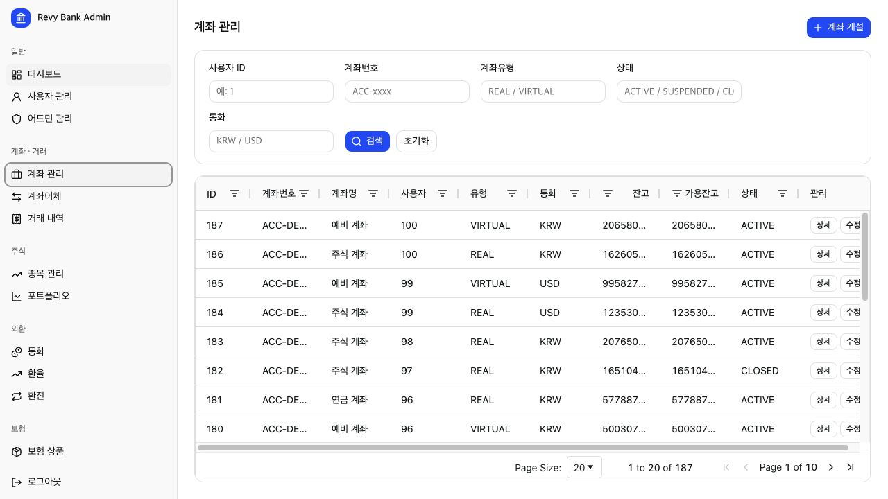
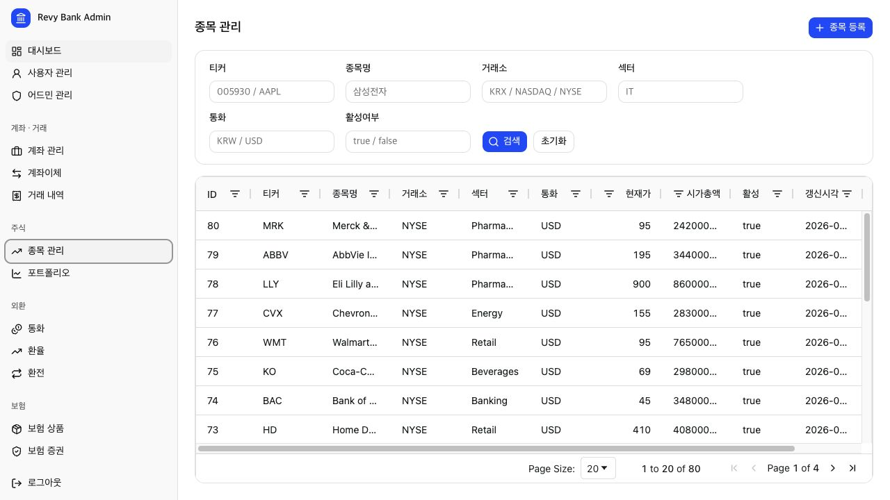
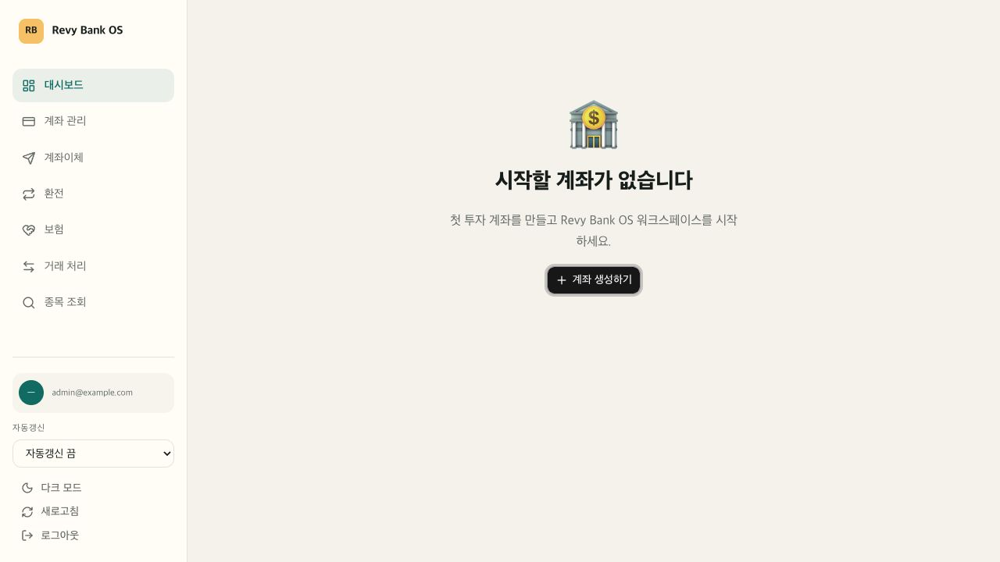
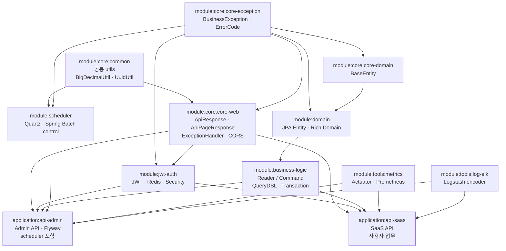

# Revy Core Banking

> Spring Boot 멀티모듈 + Next.js 풀스택 코어뱅킹 포트폴리오 프로젝트.
> 계좌·거래·주식·주문·외환·보험·원장(복식부기)·청구·정산·스케줄러 도메인을 갖춘 가상의 인터넷전문은행 시스템.

---

## DEMO 주소 정보
- WEB-ADMIN : https://demo-admin.revy-won.dev/
- WEB-SAAS : https://demo.revy-won.dev/
- Github(소스)  : https://github.com/wantedhooni/portfolio/tree/develop/core-banking

---

## 포트폴리오 문서

- [PORTFOLIO.md](./PORTFOLIO.md): 백엔드 모듈/디자인 구조, 백엔드·프론트엔드 설계 플로우, 스크린샷, API 목록
- 전체 실행: `./script/all-start.sh`
- 전체 중지: `./script/all-stop.sh`
- 전체 재시작: `./script/all-restart.sh`
- 개발 메모: `business-logic` 주요 상태 변경 Command에는 commit 이후 이벤트 발행 후보 지점을 `TODO:REVY` 주석으로 표시

---

## 대표 화면

### web-admin 운영자 콘솔

운영자 콘솔은 도메인별 검색 조건, 서버사이드 페이지네이션, 등록/수정 액션을 공통 CRUD 패턴으로 제공한다.





### web-saas 사용자 워크스페이스

사용자 워크스페이스는 계좌, 이체, 환전, 보험, 거래, 종목 조회를 하나의 금융 업무 셸에서 이동하도록 구성했다.



---

## 1. 프로젝트 개요

| 항목 | 내용 |
|---|---|
| **목표** | 실무 코어뱅킹에서 다루는 자금 이동, 상품 운용, 거래 기록, 운영 통제 흐름을 CQRS-Lite·Rich Domain·복식부기 원장 패턴으로 구현 |
| **구성** | 백엔드 멀티모듈(Java 25 / Spring Boot 4) + 프론트엔드 2개(Next.js 16 - Admin / SaaS) |
| **운영자 콘솔** | api-admin + web-admin (관리자가 계좌·사용자·상품·주문·환율·증권·분개·정산·배치 운영) |
| **사용자 앱** | api-saas + web-saas (일반 사용자가 본인 계좌·이체·매매·환전·보험 가입/청구·청구서 결제) |
| **인프라** | PostgreSQL Primary/Secondary + Pgpool-II, Redis, ELK, Prometheus/Grafana |

---

## 2. 기술 스택

### Backend
- **Language / Runtime**: Java 25, Spring Boot 4.0.6
- **ORM / Query**: JPA / Hibernate + QueryDSL 5.1 (Spring Data JPA Repository **미사용** — `JPAQueryFactory` + `EntityManager` 직접 사용)
- **Security**: Spring Security + JJWT 0.12.6 + Redis (refresh token 저장)
- **DB / Migration**: PostgreSQL + Pgpool-II + Flyway
- **Scheduler**: Quartz + Spring Batch 운영 조회/제어 모듈
- **Build**: Gradle 멀티모듈
- **Virtual Threads**: Spring `threads.virtual.enabled=true`

### Frontend
- **Framework**: Next.js 16 (App Router, React 19, Turbopack)
- **Language**: TypeScript
- **UI**: Tailwind CSS + shadcn/ui (radix-nova 스타일)
- **Data Grid**: ag-Grid (서버사이드 페이지네이션)
- **HTTP**: Axios (401 silent refresh interceptor)
- **State**: React hooks + Context (web-saas는 WorkspaceProvider)

---

## 3. 전체 디렉토리 구조

```
core-banking/
├── backend/                                Spring Boot 멀티모듈
│   ├── module/
│   │   ├── core/
│   │   │   ├── common/                    공통 utils (BigDecimalUtil, UuidUtil)
│   │   │   ├── core-exception/            BusinessException, ErrorCode
│   │   │   ├── core-web/                  GlobalExceptionHandler, AbstractCorsConfig
│   │   │   └── core-domain/               BaseEntity
│   │   ├── domain/                        JPA 엔티티 + 도메인 로직 + 도메인 예외
│   │   │   ├── account/                   Account, AccountTx, Stock, StockOrder, StockPosition, PositionLot, LotDisposal
│   │   │   ├── user/, admin/, billing/, post/
│   │   │   ├── fx/                        Currency, ExchangeRate, FxConversion
│   │   │   ├── insurance/                 InsuranceProduct, InsurancePolicy, Beneficiary,
│   │   │   │                              PremiumPayment, InsuranceClaim
│   │   │   └── ledger/                    LedgerAccount, AccountingPeriod, JournalEntry, JournalLine
│   │   ├── business-logic/                Reader / Command 인터페이스 + QueryDSL 구현
│   │   │   ├── account/                   AccountReader, AccountCommand (입출금·이체)
│   │   │   ├── stock/, order/, portfolio/, trade/
│   │   │   ├── user/, admin/, rbac/
│   │   │   ├── fx/                        FxReader, FxCommand (환전)
│   │   │   ├── insurance/                 InsuranceReader, InsuranceCommand (가입·납부·청구·지급)
│   │   │   ├── ledger/                    LedgerReader, LedgerCommand (분개·전기·역분개·시산표)
│   │   │   └── billing/, settlement/       청구서·청구 항목·정산 상태 관리
│   │   ├── jwt-auth/                      JWT 인증 모듈 (domain 미의존, 독립 사용 가능)
│   │   ├── scheduler/                     Quartz / Spring Batch 조회·제어
│   │   └── tools/                         log-elk, metrics (선택적 의존)
│   └── application/
│       ├── api-admin/                     관리자 Spring Boot 앱 (8081)
│       │   └── src/main/resources/db/migration/   Flyway DDL (V20260520...)
│       └── api-saas/                      사용자 Spring Boot 앱 (8091)
└── frontned/
    ├── web-admin/                         관리자 콘솔 (Next.js)
    │   └── src/
    │       ├── app/(dashboard)/dashboard/  도메인별 페이지
    │       ├── features/                   도메인별 PageConfig (CrudPage 어댑터)
    │       └── components/
    │           ├── data-grid/              CrudPage, PageTemplate, SearchBar, CreateModal, EditModal
    │           └── ui/                     shadcn/ui
    └── web-saas/                          사용자 워크스페이스 (Next.js)
        └── src/
            ├── app/workspace/              대시보드 / 계좌 / 이체 / 환전 / 보험 / 거래 / 종목
            ├── features/                   도메인별 service + types + 컴포넌트
            └── workspace/                  WorkspaceProvider, useWorkspace, Sidebar
```

---

## 4. 백엔드 멀티모듈 의존 관계

아래 다이어그램은 `backend/**/build.gradle`의 `project(...)` 의존성을 기준으로 정리한 실제 모듈 계층이다. 화살표는 `의존 대상 -> 사용하는 모듈` 방향이다.



### 실제 Gradle 의존성 요약

| 모듈 | 직접 의존 모듈 | 책임 |
|---|---|---|
| `module:core:common` | 없음 | `BigDecimalUtil`, `UuidUtil` 등 공통 utils |
| `module:core:core-exception` | 없음 | `BusinessException`, `ErrorCode` |
| `module:core:core-domain` | `core-exception` | `BaseEntity`, JPA 기반 엔티티 공통 |
| `module:core:core-web` | `core-common`, `core-exception` | `ApiResponse`, `ApiPageResponse`, 전역 예외 처리, CORS, OpenAPI/Validation 공통 |
| `module:domain` | `core-exception`, `core-domain` | JPA 엔티티, enum, 도메인 예외, Rich Domain 로직 |
| `module:business-logic` | `domain` | QueryDSL Reader, 트랜잭션 Command, Command/Result DTO |
| `module:jwt-auth` | `core-exception`, `core-web` | JWT 발급/검증, Redis refresh token, Security filter 지원 |
| `module:scheduler` | `core-exception`, `core-common` | Quartz/Spring Batch 메타데이터 조회와 실행 제어 |
| `module:tools:metrics` | 없음 | Actuator, Prometheus, Pushgateway 연동 |
| `module:tools:log-elk` | 없음 | Logstash encoder, Janino 기반 로그 전송 |
| `application:api-admin` | `core-web`, `jwt-auth`, `business-logic`, `scheduler`, `metrics`, `log-elk` | 관리자 API, Flyway, 운영/정산/스케줄러 제어 |
| `application:api-saas` | `core-web`, `jwt-auth`, `business-logic`, `metrics`, `log-elk` | 사용자 API, 본인 계좌 기반 금융 업무 |

**핵심 원칙:**
- `core-common`은 응답 모델이 아니라 utils 모듈이고, `ApiResponse`/`ApiPageResponse`는 `core-web`에 둔다.
- `domain`은 웹/인증 모듈에 의존하지 않고, 엔티티와 도메인 규칙만 가진다.
- `business-logic`은 `domain` 위에서 Reader/Command를 구현하며 application 계층으로 JPA 엔티티를 직접 노출하지 않는다.
- `jwt-auth`는 `domain`에 의존하지 않아 관리자/사용자 principal 전략을 application에서 조립할 수 있다.
- `scheduler`는 현재 `api-admin`에만 연결되어 사용자 API와 운영 제어 책임을 분리한다.

---

## 5. 도메인 맵

| 도메인 | 핵심 엔티티 | 비즈니스 책임 |
|---|---|---|
| **Account** | `Account`, `AccountTx` | 계좌 개설·입출금·이체·잔고/가용잔고 관리 (낙관적 락) |
| **Stock** | `Stock` | 종목 마스터 (티커·거래소·섹터) |
| **Order** | `StockOrder` | 주문 접수, 체결, 취소 상태 관리 |
| **Position** | `StockPosition`, `PositionLot`, `LotDisposal` | 매수 Lot 단위 보유 추적, FIFO 매도 처분, 실현/미실현 손익 |
| **Trade** | (커맨드만) | 매수/매도 트랜잭션 (Account + Position + Tx 동시 갱신) |
| **Portfolio** | (Reader만) | 포지션·평가금액·자산배분 집계 |
| **User / Admin / RBAC** | `User`, `Admin`, `AdminRole`, `AdminPermission` | 사용자/관리자 인증, 관리자 역할·권한 연결 |
| **FX** | `Currency`, `ExchangeRate`, `ExchangeRateHistory`, `FxCorridor`, `FxConversion` | 통화 등록, 현재 환율/이력 관리, 통화 회랑 한도·스프레드 관리, 환전 (계좌 출금/입금 + 분개) |
| **Insurance** | `InsuranceProduct`, `InsurancePolicy`, `Beneficiary`, `PremiumPayment`, `InsuranceClaim` | 상품 등록, 증권 발행, 자동이체 납부, 청구 심사·지급 |
| **Ledger** | `LedgerAccount`, `AccountingPeriod`, `JournalEntry`, `JournalLine` | 복식부기 — 계정과목·회계기간·분개·전기·역분개·시산표 |
| **Billing / Settlement** | `BillingInvoice`, `BillingItem`, `Settlement` | 청구서 발행·결제·연체 처리, 정산 생성·성공/실패 처리 |
| **Scheduler** | Quartz/Spring Batch metadata | 배치 작업·실행 이력·트리거 조회 및 운영 제어 |

---

## 6. 백엔드 요청 플로우

### 6.1 일반 흐름

```
┌────────────┐    HTTP+JWT    ┌─────────────┐
│  Client    │ ──────────────▶│ Controller  │  @RestController
└────────────┘                └──────┬──────┘
                                     │
                              JwtAuthenticationFilter
                                     │
                              @AuthenticationPrincipal JwtPrincipal
                                     │
                                     ▼
                              ┌─────────────┐
                              │   UseCase   │  application 계층, 인증·소유권 검증, payload ↔ command 매핑
                              └──────┬──────┘
                                     │
                       ┌─────────────┴────────────┐
                       ▼                          ▼
                 ┌──────────┐               ┌──────────┐
                 │  Reader  │ (조회)        │ Command  │ (변경, @Transactional)
                 │ QueryDSL │               │EntityMgr │
                 └────┬─────┘               └────┬─────┘
                      │                          │
                      ▼                          ▼
                ┌─────────────┐           ┌──────────────┐
                │ Result DTO  │           │ Domain Entity│
                └─────────────┘           │(rich method) │
                                          └──────┬───────┘
                                                 │
                                                 ▼
                                          PostgreSQL (Flyway 관리)
```

### 6.2 입금 (Deposit) 시퀀스 — 가장 단순한 케이스

```
POST /api/v1/accounts/{id}/deposit  { amount, referenceId }
  ↓
AccountController.deposit(principal, accountId, request)
  ↓
AccountUseCase.deposit(userId, accountId, request)
  ├─ ownershipValidator.requireOwner(userId, accountId)        ← 본인 계좌 확인
  └─ accountCommand.deposit(new DepositCommand(...))
       ↓
   AccountCommandImpl.deposit(command)  @Transactional
     ├─ accountReader.existsTxByReferenceId(referenceId)        ← 멱등성 체크
     ├─ Account.deposit(amount)                                 ← 도메인 메서드 (잔고 + 가용잔고 증가)
     └─ entityManager.persist(AccountTx.ofDeposit(...))         ← 거래 기록
```

### 6.3 계좌이체 (Transfer) 시퀀스 — 단일 트랜잭션에서 두 계좌 동시 갱신

```
POST /api/v1/accounts/{fromId}/transfer  { toAccountId, amount, fee, referenceId }
  ↓
AccountController.transfer → AccountUseCase.transfer
  ├─ ownershipValidator.requireOwner(userId, fromId)            ← 출금 계좌 본인 확인
  └─ accountCommand.transfer(new TransferCommand(...))
       ↓
   AccountCommandImpl.transfer  @Transactional
     ├─ accountReader.existsTxByReferenceId(referenceId)        ← 멱등성
     ├─ if (from == to) throw SameAccountTransferException
     ├─ Account from = loadAccount(fromId)
     ├─ Account to   = loadAccount(toId)
     ├─ if (from.currency != to.currency) throw CurrencyMismatchException
     ├─ from.withdraw(amount + fee)                             ← 출금측 (수수료 포함)
     ├─ persist(AccountTx.ofTransferOut(from, amount, fee, refId))
     ├─ to.deposit(amount)                                      ← 입금측
     └─ persist(AccountTx.ofTransferIn(to, amount, refId))      ← 동일 refId로 연결
```

한쪽이 실패하면 트랜잭션 전체 롤백. 같은 `referenceId`로 두 거래가 연결되어 감사 추적 가능.

### 6.4 환전 (FX Conversion) 시퀀스 — 크로스 도메인 호출

```
POST /api/v1/fx/conversions  { fromAccountId, toAccountId, fromCurrency, toCurrency, fromAmount, rateType, fee, refId }
  ↓
FxController.convert → FxUseCase.convert
  ├─ ownershipValidator.requireOwner(userId, fromAccountId)
  ├─ ownershipValidator.requireOwner(userId, toAccountId)       ← 본인 계좌 간만
  └─ fxCommand.convertCurrency(command)
       ↓
   FxCommandImpl.convertCurrency  @Transactional
     ├─ fxReader.existsConversionByReferenceId(refId)           ← 멱등성
     ├─ Currency 활성 검증, 계좌 통화 일치 검증
     ├─ fxReader.findLatestRate(from, to, rateType)             ← 최신 시세
     ├─ FxConversion fx = FxConversion.request(...)             ← 환전 기록 생성
     │  persist(fx)
     ├─ accountCommand.withdraw(fromAccount, fromAmount)        ← 출금 위임
     ├─ accountCommand.deposit(toAccount, netToAmount)          ← 입금 위임 (수수료 차감 후)
     └─ fx.complete(executedAt)                                 ← 환전 상태 COMPLETED
```

### 6.5 분개 (Journal Entry) — 복식부기 원장

```
POST /api/v1/ledger/journal  { journalNumber, entryDate, description, lines: [...] }
  ↓
LedgerJournalController → LedgerUseCase.postJournal → ledgerCommand.createAndPostJournal
  ↓
LedgerCommandImpl.createAndPostJournal  @Transactional
  ├─ ledgerReader.findPeriodContaining(entryDate)               ← 일자 포함 회계기간 자동 선택
  ├─ period.validateOpen()                                      ← OPEN 상태만 입력 허용
  ├─ JournalEntry entry = JournalEntry.draft(...)
  ├─ for each line: entry.addDebit(...) or addCredit(...)       ← 라인 추가
  ├─ persist(entry)  (CascadeType.ALL → 라인 동시 저장)
  └─ entry.post(now)                                            ← Σ차변 = Σ대변 검증 → POSTED
```

---

## 7. 핵심 설계 패턴

| 패턴 | 적용 |
|---|---|
| **CQRS-Lite** | `*Reader` (readOnly 조회) / `*Command` (쓰기) 분리 — application은 양쪽 다 호출 |
| **Rich Domain Model** | 비즈니스 로직(`Account.deposit`, `JournalEntry.post`, `InsurancePolicy.activate`)이 엔티티 내부 |
| **Factory Method** | `Account.open()`, `AccountTx.ofBuy()`, `FxConversion.request()`, `JournalEntry.draft()` |
| **Aggregate** | `StockPosition` → `PositionLot` → `LotDisposal` (`CascadeType.ALL`), `InsurancePolicy` → `Beneficiary`, `JournalEntry` → `JournalLine` |
| **Strategy + Registry** | `JwtPrincipalLoader` (ADMIN/USER별 구현체 자동 수집) |
| **Payload 컨테이너** | inner record (`AccountPayload.ModelResponse`, `InsurancePayload.EnrollRequest`) |
| **낙관적 락** | `@Version` on `Account`, `StockPosition`, `PositionLot`, `FxConversion`, `InsurancePolicy`, `InsuranceClaim`, `JournalEntry` |
| **멱등성 키** | 모든 변경 API는 `referenceId` 받음 → 중복 호출 시 skip |
| **Template Method** | `AbstractCrudApi<ID, CREQ, UREQ, SREQ, RES>` (web-admin CRUD 자동화) |
| **Ownership Validator** | `AccountOwnershipValidator.requireOwner(userId, accountId)` — saas 계층 일관 보안 |
| **운영 제어 API** | Quartz/Spring Batch 메타데이터 조회, 실행·중지·재시작, pause/resume |

---

## 8. 프론트엔드 흐름

### web-admin (관리자)
```
사용자 액션
  ↓
페이지 컴포넌트  (e.g. /dashboard/insurance/product)
  ↓
CrudPage<PageConfig>  ← features/insurance/config.ts 의 productConfig
  ↓
PageTemplate (검색바 + ag-Grid + 등록/수정/삭제 모달)
  ↓
services/crud.ts → axios api → 백엔드
```

외환 관리 화면은 현재 환율(`/dashboard/fx/rate`), 환율 이력(`/dashboard/fx/rate/history`), 통화 회랑(`/dashboard/fx/corridor`)을 분리했다. 현재 환율 등록은 `exchange_rate` 최신 행과 `exchange_rate_history` 감사 이력을 함께 갱신하고, 통화 회랑은 통화쌍별 최소/최대 금액, 일 한도, 스프레드율과 상태를 운영자가 관리한다.

### web-saas (사용자)
```
사용자 액션
  ↓
페이지 컴포넌트  (e.g. /workspace/insurance)
  ↓
useWorkspaceContext() — accounts/positions/transactions 캐시
  ↓
features/insurance/insurance.service.ts (InsuranceService 클래스)
  ↓
shared/api/client.ts → axios api (silent refresh) → 백엔드
```

---

## 9. 데이터베이스 마이그레이션

`backend/application/api-admin/src/main/resources/db/migration/`에 Flyway DDL 보관 (api-saas가 같은 DB를 공유).

| 파일 | 내용 |
|---|---|
| `V20260508165923__create_table_admin.sql` | admin |
| `V20260508165926__create_table_user.sql` | user |
| `V20260508165928__create_table_post.sql` | post (샘플) |
| `V20260510150100__add_post_demo_data.sql` | post 데모 |
| `V20260518194207__create_table_account.sql` | account |
| `V20260518203057__create_table_account_tx.sql` | account_tx |
| `V20260518203533__create_table_module_stock.sql` | stock, stock_position, position_lot, lot_disposal |
| `V20260519160000__add_large_demo_data.sql` | 대용량 데모 데이터 |
| `V20260520100000__create_table_fx.sql` | currency, exchange_rate, fx_conversion |
| `V20260520100100__create_table_insurance.sql` | insurance_product, insurance_policy, beneficiary, premium_payment, insurance_claim |
| `V20260520100200__create_table_ledger.sql` | ledger_account, accounting_period, journal_entry, journal_line |
| `V20260521120000__create_scheduler_tables.sql` | Quartz / Spring Batch 메타 테이블 |
| `V20260522120000__create_table_admin_role.sql` | 관리자 역할·권한·매핑 |
| `V20260522130000__create_table_stock_order.sql` | 주식 주문 |
| `V20260522130100__create_table_billing_invoice.sql` | 청구서 |
| `V20260522130200__create_table_billing_item.sql` | 청구 항목 |
| `V20260522130300__create_table_settlement.sql` | 정산 |
| `V20260527000001__refactor_exchange_rate_add_corridor.sql` | 현재 환율/환율 이력 분리, 통화 회랑 |

JPA는 `ddl-auto: validate` 모드 — 스키마 변경은 Flyway만으로 관리.

---

## 10. 실행 방법

### 사전 조건
- Java 25
- Node.js 20+
- Docker / Docker Compose
- 로컬 포트 `5431`, `6379`, `8081`, `8091`, `18081`, `18091`, `33000`, `39090`, `39091` 사용 가능

### 전체 실행
```bash
./script/all-start.sh
```

전체 중지/재시작:
```bash
./script/all-stop.sh
./script/all-restart.sh
```

통합 시작 스크립트는 PostgreSQL Primary/Secondary + Pgpool-II, Redis, ELK, Prometheus/Grafana를 먼저 기동한 뒤 백엔드 2개와 프론트엔드 2개를 실행한다.

### 백엔드
```bash
cd backend
./gradlew :application:api-admin:bootRun    # 관리자 API (기본 8081)
./gradlew :application:api-saas:bootRun     # 사용자 API (기본 8091)
```

환경변수:
```
ADMIN_DB_URL=jdbc:postgresql://localhost:5431/appdb
DB_USERNAME=postgres
DB_PASSWORD=postgres
REDIS_HOST=localhost
REDIS_PORT=6379
APP_PROFILE=local
```

### 프론트엔드
```bash
cd frontned/web-admin && npm install && npm run dev    # 관리자 콘솔
cd frontned/web-saas  && npm install && npm run dev    # 사용자 워크스페이스
```

### Swagger UI
- 관리자: `http://localhost:8081/swagger-ui/index.html`
- 사용자: `http://localhost:8091/swagger-ui/index.html`

### 운영 모니터링
- Grafana: `http://localhost:33000` (`admin / admin`)
- Prometheus: `http://localhost:39090`
- Pushgateway: `http://localhost:39091`
- 기본 대시보드: Grafana 로그인 후 `Core Banking / Core Banking Operations`
- 자동 등록 파일:
  - Datasource: `backend/infra/metrics/grafana/provisioning/datasources/prometheus.yml`
  - Dashboard provider: `backend/infra/metrics/grafana/provisioning/dashboards/core-banking.yml`
  - Dashboard JSON: `backend/infra/metrics/grafana/dashboards/core-banking-operations.json`

기본 대시보드는 현업 운영에서 우선 확인하는 HTTP 처리량, 5xx 비율, 응답시간 p95/평균, JVM heap/메모리 풀/스레드/GC, CPU, HikariCP 커넥션 풀, 로그 이벤트, Pushgateway 수집 지연을 포함한다. Prometheus는 Pushgateway scrape 시 `honor_labels: true`를 사용해 Spring Boot가 push한 `job`, `application`, `instance` 라벨을 보존한다.

### 데모 계정
- 관리자: `admin@example.com / Qwer1234!`
- 사용자: `demo@example.com / Qwer1234!`

---

## 11. API 경로 컨벤션

| 영역 | api-admin | api-saas |
|---|---|---|
| **계좌** | `/api/v1/account` (CRUD + 입금/출금/이체) | `/api/v1/accounts` (본인 계좌만, 이체 포함) |
| **거래내역** | `/api/v1/account_tx` | `/api/v1/accounts/{id}/transactions` |
| **포지션** | `/api/v1/portfolio` | `/api/v1/accounts/{id}/positions` |
| **종목** | `/api/v1/stock` | `/api/v1/stocks` (조회만) |
| **주문** | `/api/v1/order` | — |
| **매매** | `/api/v1/trade` (조회) | `/api/v1/accounts/{id}/trades` (BUY/SELL/DIVIDEND) |
| **외환 통화** | `/api/v1/fx/currency` | `/api/v1/fx/currencies` (공개) |
| **외환 환율** | `/api/v1/fx/rate`, `/api/v1/fx/rate/current`, `/api/v1/fx/rate/history` | `/api/v1/fx/rate/latest` (공개) |
| **외환 회랑** | `/api/v1/fx/corridor` | — |
| **외환 환전** | `/api/v1/fx/conversion` | `/api/v1/fx/conversions` (본인 계좌 간) |
| **보험 상품** | `/api/v1/insurance/product` (CRUD) | `/api/v1/insurance/products` (공개, 활성만) |
| **보험 증권** | `/api/v1/insurance/policy` (전체) | `/api/v1/insurance/policies` (본인) |
| **보험 청구** | `/api/v1/insurance/claim` (심사/지급) | `/api/v1/insurance/claims` (본인 접수) |
| **원장 계정** | `/api/v1/ledger/account` | — |
| **원장 기간** | `/api/v1/ledger/period` | — |
| **원장 분개** | `/api/v1/ledger/journal` (+ `/trial-balance`) | — |
| **청구/정산** | `/api/v1/billing/invoice`, `/api/v1/settlement` | `/api/v1/billing/invoices` |
| **운영 스케줄러** | `/api/v1/scheduler/quartz`, `/api/v1/scheduler/batch` | — |
| **RBAC** | `/api/v1/role`, `/api/v1/admin/{adminId}/roles/{roleId}` | — |
| **사용자/관리자** | `/api/v1/user`, `/api/v1/admin` | `/api/v1/auth/signup`, `/api/v1/auth/login` |

---

## 12. 보안 모델

| 계층 | 책임 |
|---|---|
| `SecurityConfig.ALLOW_LIST` | 인증 없이 접근 가능한 경로 (Swagger, 로그인, 공개 FX/보험 상품 조회) |
| `JwtAuthenticationFilter` | 토큰 검증 → `JwtPrincipal` 주입 |
| `JwtPrincipalLoader` (Strategy) | ADMIN/USER에 따라 다른 Principal 로딩 |
| `AccountOwnershipValidator` | saas 계층에서 본인 계좌 검증 — 출금/이체/환전/결제계좌/지급계좌 등 모든 자원 접근 시 사용 |
| `policy.userId.equals(JWT.userId)` | 본인 증권/청구만 조회·수정 (Insurance) |
| `@Version` 낙관적 락 | 동시 입출금·매매 충돌 감지 → `OptimisticLockException` → 호출부 재시도 |

---

## 13. 프로젝트 분석 요약

### 구현 강점
- **금융 도메인 연결성**: 계좌 잔고, 거래 내역, 주식 포지션, 환전, 보험, 원장, 청구/정산을 단일 PostgreSQL 스키마에서 연결한다.
- **운영자/사용자 경계**: Admin API는 전체 리소스 운영과 스케줄러 제어를 담당하고, SaaS API는 본인 계좌 소유권 검증을 중심으로 제한된 사용자 업무만 제공한다.
- **실무형 데이터 흐름**: 변경 작업은 Command에서 트랜잭션을 잡고 도메인 엔티티 메서드로 상태 전이를 수행하며, 조회는 Reader와 Result DTO로 분리한다.
- **로컬 운영 재현성**: Pgpool-II, PostgreSQL 복제, Redis DB 분리, ELK, Prometheus/Grafana를 포함해 단일 개발 앱을 넘어 운영 인프라 흐름까지 설명 가능하다.

### 현재 한계와 개선 후보
- 자동화 테스트 디렉터리는 존재하지만 현재 주요 도메인 테스트 파일은 비어 있다. 계좌 이체, FIFO 매도, 환전, 보험금 지급, 분개 균형 검증부터 테스트를 추가하는 것이 우선이다.
- `TODO:REVY`로 표시한 상태 변경 이후 이벤트 발행 지점은 Outbox 패턴이나 메시지 브로커 연동으로 확장할 수 있다.
- 운영 환경 수준에서는 Pgpool watchdog, DB failover 검증, access token blacklist 정책, 배치 워커 분리 배포가 추가로 필요하다.

---

## 14. 추가 문서

- `frontned/web-admin/CLAUDE.md` — 어드민 프론트 아키텍처 가이드
- `frontned/web-saas/CLAUDE.md` — SaaS 프론트 아키텍처 가이드
- `frontned/web-admin/DEVELOPMENT.md` — 어드민 개발 노트

---

## 개선 로드맵(TODO)

- 핵심 도메인 테스트 추가: 계좌 이체, FIFO 매도, 환전, 보험금 지급, 분개 균형 검증을 우선순위로 둔다.
- 상태 변경 이벤트 고도화: 현재 `TODO:REVY`로 표시된 발행 후보 지점을 Outbox 패턴과 연계한다.
- 운영 안정성 강화: Pgpool watchdog, DB failover 리허설, 배치 워커 분리, 장애 알림 룰을 추가한다.

*Java 25 / Spring Boot 4 / Next.js 16 풀스택 코어뱅킹 포트폴리오*
