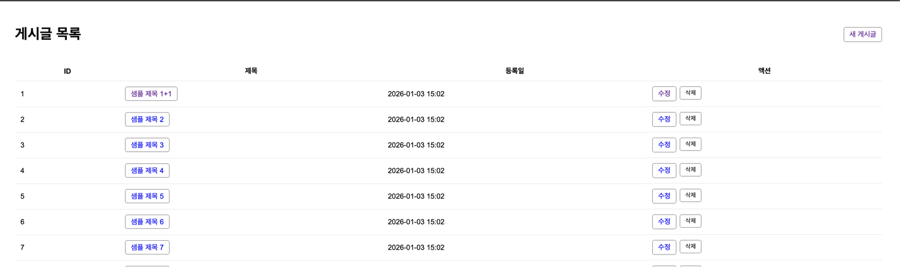
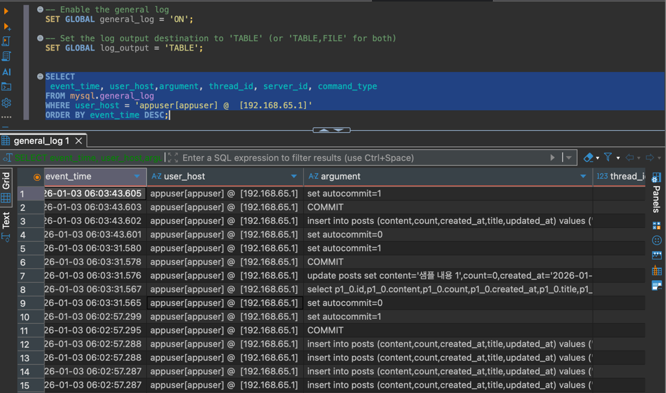
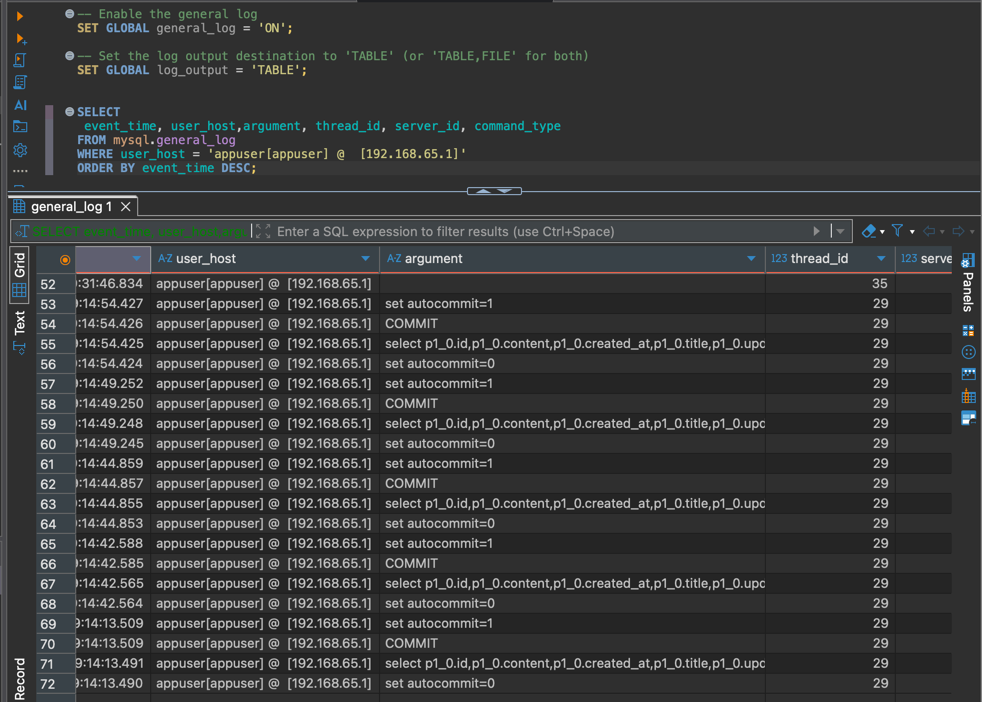

# Spring DataSource 샘픔

프로파일별 
- H2
- Mariadb
- Mariadb-replica (Read / Write 라우팅)
- - readonly가 아니면 Primary로 쿼리
- - readonly이면 secondary로 쿼리
---

프로파일 정보
--- 
default: h2
h2 -> h2db 사용
mariadb -> mariadb primary 사용
mariadb_repl -> primary / secondary 사용

## 접속 URL: http://localhost:8080/posts

## mariadb_repl -> primary / secondary 사용시 쿼리확인
### Primary로 쿼리 확인

### secondary 쿼리 확인
