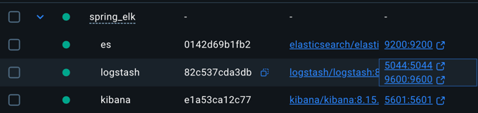

# spring_elk

spring_elk 연습

노트
---
기존에 했듯이 로그를 ELK로 보내기 연습

- es: http://localhost:9200/
- logstash: http://localhost:9600/
- kibana: http://localhost:5601/app/home

---

H2 DB 콘솔
---
- http://localhost:8080/h2-console/login.jsp

api-docs
---
- http://localhost:8080/api-docs
- http://localhost:8080/swagger-ui.html

kafka 정보
---

- kafka UI
  - http://localhost:8090/
- kafka port
  - localhost:9092

Spring kafka 자료
---
https://spring.io/projects/spring-kafka
https://github.com/spring-projects/spring-kafka/tree/main/samples

