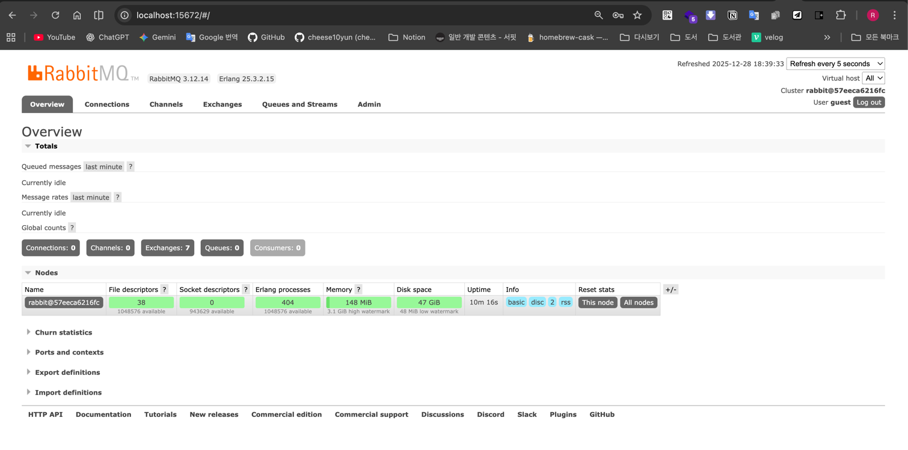
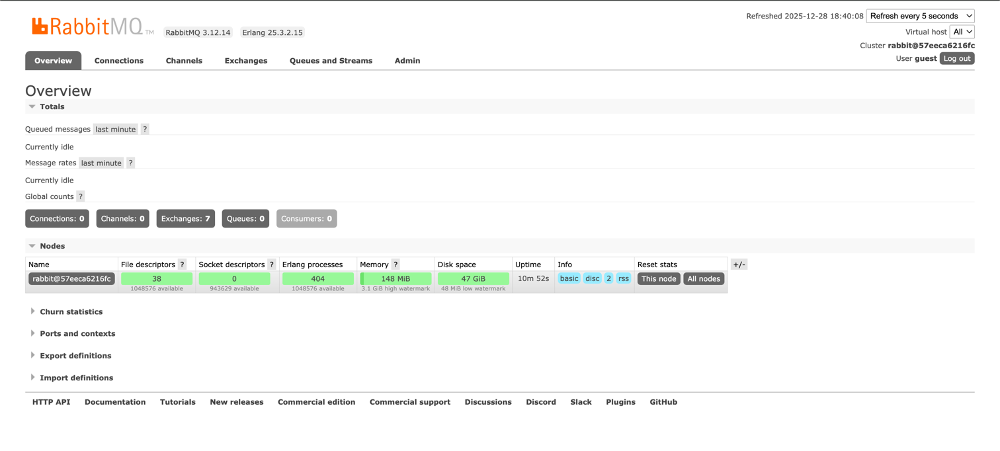

# spring_scdf

spring_scdf
Spring Cloud Data Flow 연습

인프라 URL 정보
---
| 항목          | URL                                                    |
|-------------| ------------------------------------------------------ |
| SCDF UI     | [http://localhost:9393/dashboard/index.html#/apps](http://localhost:9393/dashboard/index.html#/apps)         |
| RabbitMQ UI | [http://localhost:15672](http://localhost:15672)       |
| Skipper API | [http://localhost:7577/api](http://localhost:7577/api) |
| postgres DB | localhost:5432                                         |

DB
---
- url: postgres DB
- user: scdf
- pw : scdf

SCDF UI
---
- http://localhost:9393/dashboard/index.html#/apps

RabbitMQ
---
- 기본 계정 정보
- Username: guest
- password: guest
- http://localhost:15672/
- 
