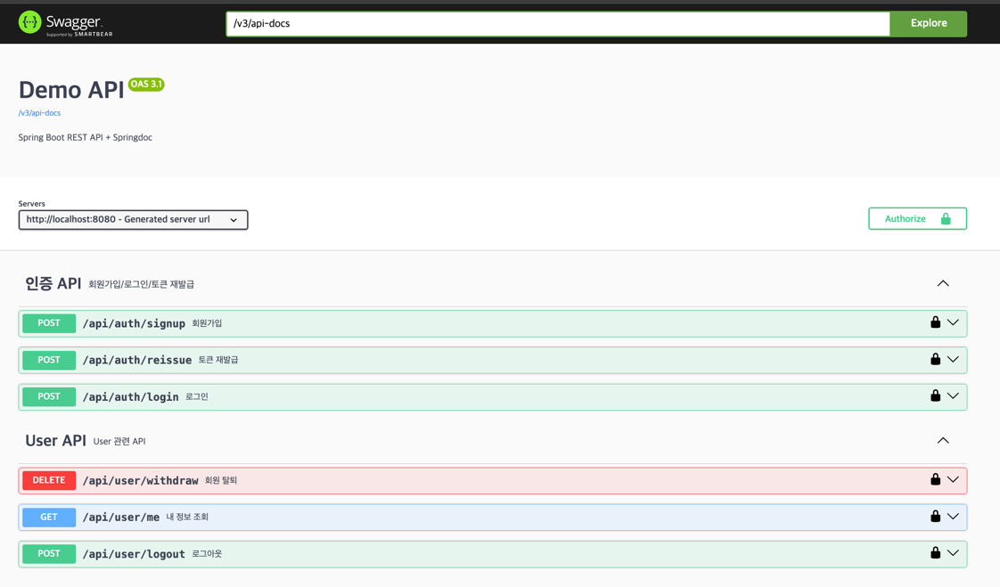

# spring_security_jwt
Spring boot JWT 연습

잡담
---
아 Req/Res <-> command / result
강결함도 싫고, 
리플랙션 기반 mapper 사용하기도 싫다.
좋은 방법이 없을까?
레이어별 형변환 지옥인데
이름 머하지?

todo
---
- [ ] accessToken DB 테이블로도 관리해볼까?

기록
```
jwt:
  # MAC 기준  
  # openssl rand -hex 64
  secret-key: 6082ff86d0ed168624d71b757031f7c49ab8929cdb5830dd59e6da887761005cdaabb13b3369751fa0dc194f6a6c49a5ea74d3332ef2f21fd806cf57426d9e51
```
   

H2 DB 콘솔
---
- http://localhost:8080/h2-console/login.jsp

DB 접속
---
- jdbc:h2:tcp://localhost:13306/mem:testdb

Redis 정보
---
- WEB UI: http://localhost:8081/


api-docs
---
- http://localhost:8080/swagger-ui.html
- http://localhost:8080/v3/api-docs



